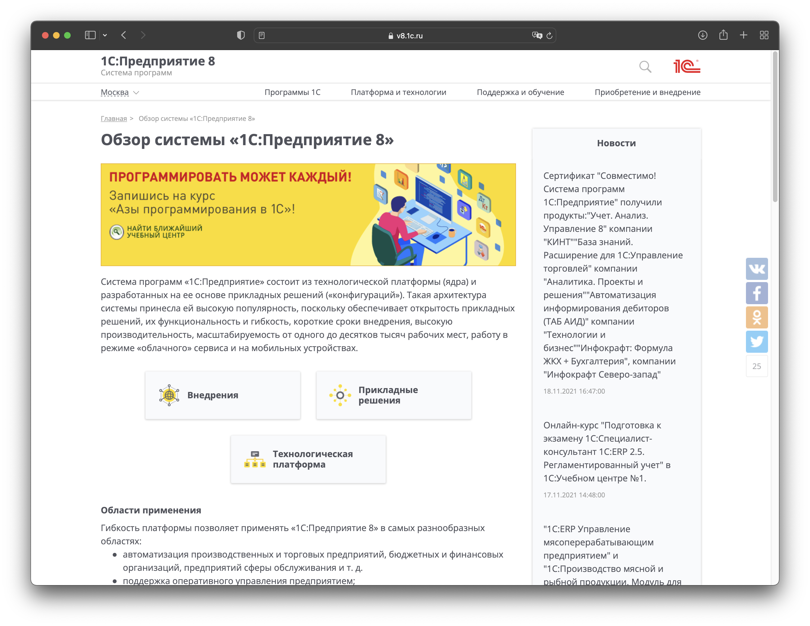
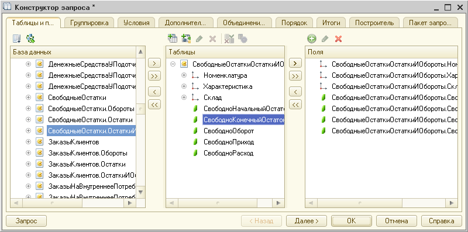
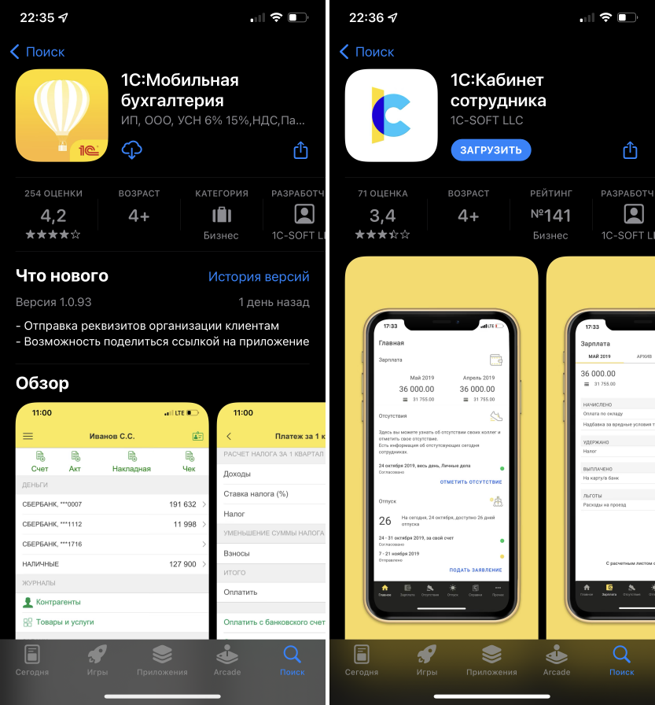
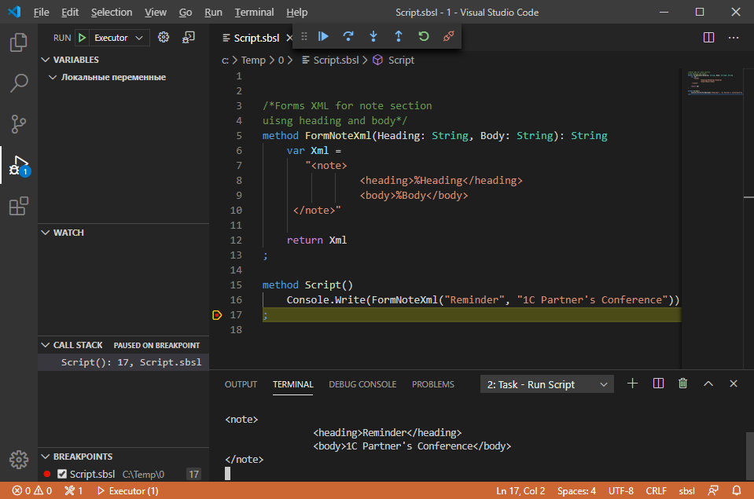
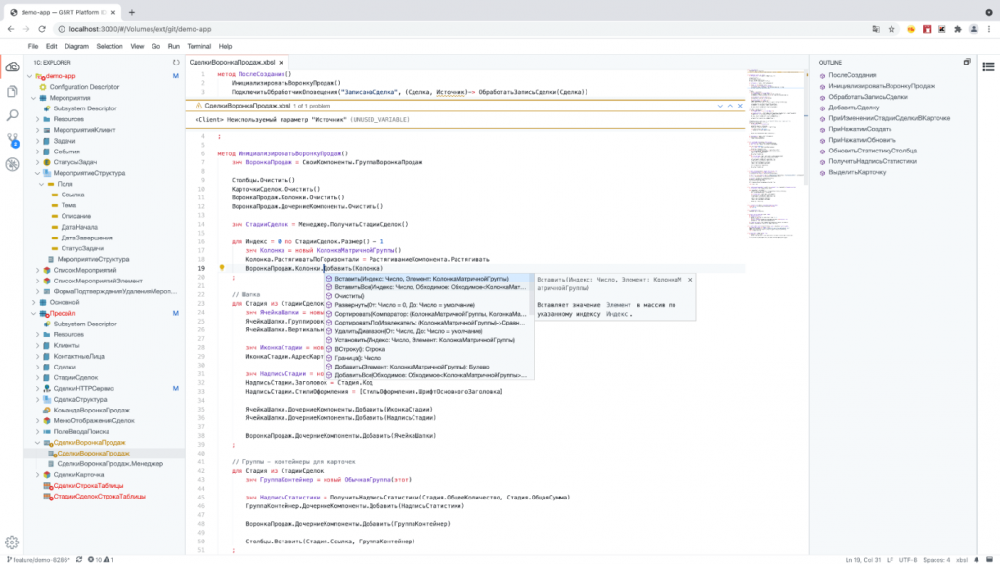
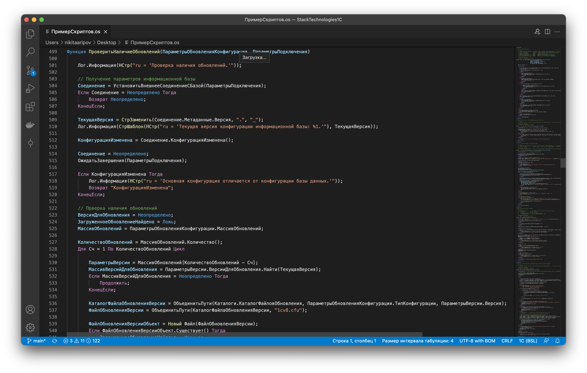
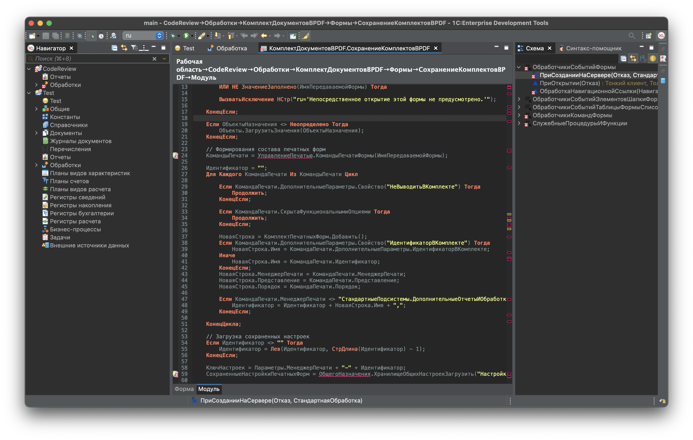

# Стек технологий для 1С
- [Стек технологий для 1С](#стек-технологий-для-1с)
- [Разработка](#разработка)
  - [Языки программирования](#языки-программирования)
    - [Встроенный язык программирования 1С:Предприятия](#встроенный-язык-программирования-1спредприятия)
    - [Язык запросов](#язык-запросов)
    - [Платформа для мобильных устройств](#платформа-для-мобильных-устройств)
    - [1С:Исполнитель](#1сисполнитель)
    - [1С:Предприятие.Элемент](#1спредприятиеэлемент)
    - [OneScript](#onescript)
  - [IDE](#ide)
    - [Конфигуратор](#конфигуратор)
    - [1C:Enterprise Development Tools (EDT)](#1centerprise-development-tools-edt)
    - [Visual Studio Code (VSCode)](#visual-studio-code-vscode)
  - [Плагины](#плагины)
    - [Снегопат](#снегопат)
    - [BSL Plagin](#bsl-plagin)
    - [Подсистема разработчика](#подсистема-разработчика)
    - [Шаблоны кода](#шаблоны-кода)
- [Системы хранения версий](#системы-хранения-версий)
  - [Хранилище](#хранилище)
  - [git](#git)
- [Прототипирование](#прототипирование)
  - [MockPlus](#mockplus)
  - [mock1c](#mock1c)
- [Повышение качества продуктов](#повышение-качества-продуктов)
  - [Автоматизированное тестирование](#автоматизированное-тестирование)
  - [1С:Сценарное тестирование](#1ссценарное-тестирование)
  - [1С:Тестировщик](#1стестировщик)
  - [Vanessa Behavior](#vanessa-behavior)
  - [xUnitFor1C](#xunitfor1c)
  - [Статический анализ текста](#статический-анализ-текста)
    - [Синтаксическая проверка конфигурации](#синтаксическая-проверка-конфигурации)
    - [1С:Автоматизированная проверка конфигураций](#1савтоматизированная-проверка-конфигураций)
    - [Плагин для SonarQube](#плагин-для-sonarqube)
  - [Прочее](#прочее)
    - [Code-review](#code-review)
    - [Стандарты разработки](#стандарты-разработки)
    - [Allure](#allure)
- [CI/CD](#cicd)
    - [Gitlab CI](#gitlab-ci)
    - [Jenkins](#jenkins)
    - [Docker](#docker)
- [Интеграции](#интеграции)
    - [1С:Аналитика](#1саналитика)
    - [Телеграмм бот](#телеграмм-бот)
    - [Rabbit MQ](#rabbit-mq)
    - [Kafka](#kafka)
    - [Power BI](#power-bi)
- [Продуктивность](#продуктивность)
  - [Трекеры задач](#трекеры-задач)
    - [Командные:](#командные)
    - [Личные:](#личные)
  - [Базы знаний](#базы-знаний)
    - [Notion](#notion)
    - [Confluence](#confluence)
    - [Wiki](#wiki)
- [Благодарность](#благодарность)

# Разработка
## Языки программирования
### Встроенный язык программирования 1С:Предприятия

Встроенный язык системы 1С:Предприятия. На стадии разработки конфигурации предназначен для описания алгоритмов функционирования прикладной задачи. Основной язык разработчика 1С.

​

**На что обратить внимание**

Новые возможности языка программирования обычно добавляют при выпуске новых версий платформы.
Поэтому имеет смысл отслеживать изменения в версиях, чтобы использовать новые технологии.

**С чего начать:**

Книги:
1. М.Г. Радченко. - 1С:Програмирование для начинающих - https://buh.ru/books/detail.php?ID=51780

Курсы:
1. Учебный центр 1С - https://uc1.1c.ru
2. Хорошие курсы на сайте https://курсы-по-1с.рф

**Подробнее:**
1. Официальный сайт: https://v8.1c.ru/platforma/  
2. Документация к платформе: https://its.1c.ru/db/v8320doc

[В начало](#стек-технологий-для-1с)
### Язык запросов
Язык запросов основан на [SQL](https://ru.wikipedia.org/wiki/SQL), при этом содержит как ограничения так и расширения, ориентированные на отражение специфики финансово-экономических задач.

​

**На что обратить внимание:**

1. Статья - [Типичные причины неоптимальной работы запросов и методы оптимизации](https://its.1c.ru/db/metod8dev/content/5842/hdoc). 
Следуя этим рекомендациям можно избежать большинство проблем с производительностью запросов.
2. Для отладки запросов можно использовать Консоль запросов. Этот инструмент позволяет выполнять и отлаживать запросы в режиме 1С:Предприятие.
Разработок на эту тему много, можно поискать по запросу [Консоль запросов](https://infostart.ru/public/all/?st=t&sort=postsd&public-filter%5Bsearch%5D=%CA%EE%ED%F1%EE%EB%FC+%E7%E0%EF%F0%EE%F1%EE%E2)

**С чего начать:**

Статьи:

1. Особенности языка запросов 1С - https://infostart.ru/1c/articles/204054/
2. Полезные сведения о языке запросов 1С 8.2 - https://infostart.ru/1c/articles/165456/

Книги:
1. Е. Ю. Хрусталева - Язык запросов 1С:Предприятия 8 - https://its.1c.ru/db/pubqlang

**Подробнее**
1. Официальный сайт: https://v8.1c.ru/platforma/mehanizm-zaprosov/

[В начало](#стек-технологий-для-1с)

### Платформа для мобильных устройств
Платформа для разработки мобильный приложений .По факту используется тот же язык программирования, но есть ограничения. Платформа позволяет разработать и собрать приложение для мобильных устройств.

​

**На что обратить внимание**

Есть много хороших программ, созданных с помощью мобильной платформы как вендора, так и сторонних разработчиков.
Это хорошее направление для развития, так как мобильные приложения все больше требуются в различных компаниях.

**С чего начать:**

Книги:
1. Е. Ю. Хрусталева - Знакомство с разработкой мобильных приложений на платформе 1С:Предприятие 8 - https://v8.1c.ru/metod/books/42725.htm

Статьи:
1. О мобильной платформе 1С - https://habr.com/ru/company/1c/blog/283198/

**Подробнее:**
1. Официальный сайт - https://mobile.1c.ru
2. Мобильная среда - https://mobile.1c.ru/sreda/

[В начало](#стек-технологий-для-1с)

### 1С:Исполнитель

Это кроссплатформенный язык сценариев. Язык базируется на встроенном языке разработки 1С:Предприятие, но имеет ряд отличий от него.
1С:Исполнитель - это инструмент для автоматизиации и администрирования информационных систем, созданных на платформе 1С:Предприятие.

​

**На что обратить внимание**

Кажется, что этот язык - это "проба пера" для нового языка и новых технологий фирмы 1С.
Имеет смысл ознакомиться с новыми возможностями, но глубоко изучать язык, кажется, не обязательным.
Так как сфера применения его довольно специфичная.

**С чего начать:**
1. Статья на зазеркалье - https://wonderland.v8.1c.ru/blog/1c-ispolnitel/

[В начало](#стек-технологий-для-1с)

### 1С:Предприятие.Элемент
Новая разработка фирмы 1С. Информации пока не много. Сообщается, что это тот же язык, что используется в 1С:Исполнитель.

В качестве основных компонентов технологии обозначены:
- новый пользовательский интерфейс, ориентированный в первую очередь на работу в веб;
- динамично развивающийся встроенный язык;
- поддержка модульности разработки;
- среда разработки, развернутая в облаке и доступная через браузер;
- ориентация на работу решений в облаке, но будет поддержка и локальной установки (on-premise);
- мобильность, что подразумевает возможность работы приложения на мобильных устройствах и в мобильных браузерах сразу «из коробки».

​

**На что обратить внимание**

Решения, уже использующие эту технологию:
- [«1С:Кабинет сотрудника»](https://portal.1c.ru/applications/94)
- [1С:Шина](https://wonderland.v8.1c.ru/blog/integratsionnaya-shina/)
- Сервис [mag1C](https://mag1c.ru)
- [1С:Аналитика](https://wonderland.v8.1c.ru/blog/1s-analitika/)
- Сайт [developer.1c.ru](https://developer.1c.ru) создан с помощью этой технологии

**С чего начать:**
1. Статья на зазеркалье - https://wonderland.v8.1c.ru/blog/novaya-tekhnologiya-razrabotki-prilozheniy/

[В начало](#стек-технологий-для-1с)

### OneScript

Проект является независимой кросс-платформенной реализацией виртуальной машины, испольняющей скрипты на языке 1С:Предприятие. При это не требуется установка системы 1С:Предприятие на целевой машине.
Основные возможности:
- Использование в качестве среды исполнения текстовых сценариев на языке 1С;
- Построение консольных приложений, написанных на языке 1С;
- Встраивание в стороннюю программную среду в качестве среды исполнения текстовых сценариев на языке 1С.

​

**На что обратить внимание**

Удобство языка в том, что у него низкий порог вхождения - если знаете язык 1С, то сможете легко писать и понимать OneScript.
Язык помогает решать различные задачи, вплоть до запуска тестов и сборки конфигураций.

**С чего начать:**
1. Статья - [Начало работы с OneScript](https://infostart.ru/1c/articles/687869/)
2. Статья - [Как решать повседневные задачи с помощью OneScript](http://infostart.ru/public/327581/)
3. Статья - [Примеры скриптов на OneScript](https://infostart.ru/public/537028/)

**Подробнее**
1. Официальный сайт - https://oscript.io/
2. Исходный код - https://github.com/EvilBeaver/OneScript

[В начало](#стек-технологий-для-1с)

## IDE
IDE - Это интегрированная среда разработки (англ. Integrated development environment) - программное средство, используемое программистами для разработки программного обеспечения. Обычно включает в себя: редактор, компилятор и отладчик.

### Конфигуратор
Конфигуратор - предметно-ориентированная среда быстрой разработки, существующая в платформе 1С:Предпрития 8.
Предоставляет программисту инструмекнты для разработки и поддержки конфигураций.

​

**На что обратить внимание:**

Конфигуратор, на текущий момент, основная среда разработки конфигураций. Это наиболее распространненый инструмент для разработки и доработки конфигураций.

**С чего начать:**
1. Статья - [Основные приемы работы в конфигураторе](https://курсы-по-1с.рф/articles/приемы-работы-в-конфигураторе/)

**Подробнее:**
1. Официальный сайт - https://v8.1c.ru/platforma/sreda-bystroy-razrabotki/

### 1C:Enterprise Development Tools (EDT)

1C:EDT это современная расширяемая среда разработки прикладных решений. Она создана на основе свободной интегрированной среды разработки модульных кроссплатформенных приложений Eclipse, широко используемой разработчиками во всем мире.

​

**На что обратить внимание:**

1С:EDT - это относительно новая среда разработки, которая широко развивается в отличие от Конфигуратора. Регулярно выходят новые версии с исправлениями ошибок и развитием функциональности.

EDT очень требователен к ресурсам и настройкам. Обязательно стоит выполнить [настройку EDT для импорта больших конфигураций](https://edt.1c.ru/docs/examples/nastroyka-edt-dlya-importa-bolshikh-konfiguratsiy/).

На EDT можно переходить постепенно, для этого фирма 1С выпустила рекомендации.

**С чего начать:**
1. Статья - [Знакомство на примерах](https://edt.1c.ru/docs/examples/)
2. Статья - [Постепенный процесс перехода на EDT](https://edt.1c.ru/upload/docs_git/topics/t000040.html)
3. Курсы - [Профессиональная разработка в 1С:EDT](https://курсы-по-1с.рф/courses/dev-edt-and-git/)
4. Неофициальный телеграмм-канал - https://t.me/edt1c

**Подробнее:**
1. Официальный сайт - https://edt.1c.ru/
2. Документация - https://edt.1c.ru/docs/
3. Официальный телеграмм-канал - https://t.me/e1c_edt

### Visual Studio Code (VSCode)

## Плагины
Плагины, которые помогают в разработке на языках 1С

### Снегопат

### BSL Plagin

### Подсистема разработчика

### Шаблоны кода
# Системы хранения версий
Нужны для того, чтобы отслеживать версии кода и можно было легче возвращаться.
Широко используются при командной разработке, но и при индивидуальной тоже дают свои плюсы.

## Хранилище
Нативная система хранения версий для 1С. Работает только с конфигуратором.

## git

Удаленные репозитории:
GitHub
GitLab
Bitbucket 

# Прототипирование
Система программ для быстрого создания прототипов. Позволяет без конфигурирования сделать макет формы.

## MockPlus 
Про него рассказывали на партнерском семинаре

## mock1c
Энтузиасты сделали отдельный механизм

# Повышение качества продуктов
Автоматизированное тестирование для 1С

## Автоматизированное тестирование
## 1С:Сценарное тестирование
Инструмент от вендора, который позволяет строить автотесты

## 1С:Тестировщик
Легкая версия 1С:Сценарное тестирование
## Vanessa Behavior 
Инструмент от разработчиков, который тоже позволяет строить автотесты

## xUnitFor1C
Юнит тесты для 1С. Сторонний механизм

## Статический анализ текста
### Синтаксическая проверка конфигурации

### 1С:Автоматизированная проверка конфигураций

### Плагин для SonarQube

## Прочее

### Code-review
Проведение обзора кода, чтобы исключить ошибки или типа того

### Стандарты разработки
1С публикует стандарты разработки, чтобы решения были качественные

### Allure
Инструмент для красивого отображения результатов тестирования

# CI/CD

### Gitlab CI

Аналоги:
- Travis CI
- Github CI

### Jenkins

### Docker

# Интеграции

### 1С:Аналитика

### Телеграмм бот

### Rabbit MQ

### Kafka

### Power BI

# Продуктивность

## Трекеры задач

### Командные:
Jira
Bitrix24

### Личные:
Todoist
Wunderlinst

## Базы знаний

### Notion

### Confluence

### Wiki

# Благодарность
Если статья была полезная или просто хотите поддержать автора,
то можете купить мне кофе - https://yoomoney.ru/to/410011910320096
