# Стек технологий для 1С

​ ​ ​ ​

​ ​ ​ ​ ​ ​ ​ ​ ​

Стек технологий, которые могут быть полезны разработчику на 1С и около 1С.
По каждой технологии постарался объяснить зачем она нужна и с чего начать изучение, если заинтересует.

- [Стек технологий для 1С](#стек-технологий-для-1с)
- [Разработка](#разработка)
  - [Языки программирования](#языки-программирования)
    - [Встроенный язык программирования 1С:Предприятия](#встроенный-язык-программирования-1спредприятия)
    - [Язык запросов](#язык-запросов)
    - [Платформа для мобильных устройств](#платформа-для-мобильных-устройств)
    - [1С:Исполнитель](#1сисполнитель)
    - [1С:Предприятие.Элемент](#1спредприятиеэлемент)
    - [OneScript](#onescript)
  - [IDE](#ide)
    - [Конфигуратор](#конфигуратор)
    - [1C:Enterprise Development Tools (EDT)](#1centerprise-development-tools-edt)
    - [Visual Studio Code (VSCode)](#visual-studio-code-vscode)
  - [Плагины](#плагины)
    - [Снегопат](#снегопат)
    - [Подсистема "Инструменты разработчика"](#подсистема-инструменты-разработчика)
    - [Подсистема "Универсальные инструменты 1С для управляемых форм"](#подсистема-универсальные-инструменты-1с-для-управляемых-форм)
    - [Плагин для конфигуратора PhoenixBSL](#плагин-для-конфигуратора-phoenixbsl)
    - [Плагины для 1С:EDT](#плагины-для-1сedt)
- [Системы хранения версий](#системы-хранения-версий)
  - [Хранилище](#хранилище)
  - [git](#git)
- [Прототипирование](#прототипирование)
  - [1CMaker](#1cmaker)
- [Повышение качества](#повышение-качества)
  - [Автоматизированное тестирование](#автоматизированное-тестирование)
    - [1С:Тестировщик и 1С:Сценарное тестирование](#1стестировщик-и-1ссценарное-тестирование)
    - [Vanessa-Automation и Vanessa-ADD](#vanessa-automation-и-vanessa-add)
  - [Статический анализ кода](#статический-анализ-кода)
    - [Синтаксическая проверка конфигурации](#синтаксическая-проверка-конфигурации)
    - [1С:Автоматизированная проверка конфигураций](#1савтоматизированная-проверка-конфигураций)
    - [Плагин для SonarQube](#плагин-для-sonarqube)
  - [Прочее](#прочее)
    - [Code-review](#code-review)
    - [Стандарты разработки](#стандарты-разработки)
- [CI/CD](#cicd)
  - [Jenkins](#jenkins)
  - [Gitlab CI](#gitlab-ci)
  - [Vagrant](#vagrant)
  - [Docker](#docker)
  - [Allure](#allure)
- [Интеграции](#интеграции)
  - [1С:Конвертация данных и EnterpriseData](#1сконвертация-данных-и-enterprisedata)
  - [Telegram бот](#telegram-бот)
  - [Брокеры сообщений (RabbitMQ, Kafka и другие)](#брокеры-сообщений-rabbitmq-kafka-и-другие)
  - [BI-системы](#bi-системы)
    - [1С:Аналитика](#1саналитика)
    - [Microsoft Power BI](#microsoft-power-bi)
- [Благодарность](#благодарность)

# Разработка

## Языки программирования

### Встроенный язык программирования 1С:Предприятия

Встроенный язык системы 1С:Предприятия. На стадии разработки конфигурации предназначен для описания алгоритмов функционирования прикладной задачи. Основной язык разработчика 1С.

​

**Зачем нужно:**

Это основной язык разработки программиста 1С. Львиная часть работы делаем именно с помощью этого языка.

**Заметки:**

Новые возможности языка программирования обычно добавляют при выпуске новых версий платформы.
Поэтому имеет смысл отслеживать изменения в версиях, чтобы использовать новые технологии.

**С чего начать:**

1. Книга - [М.Г. Радченко. - 1С:Програмирование для начинающих](https://buh.ru/books/detail.php?ID=51780)
2. Курсы - [Учебный центр 1С](https://uc1.1c.ru)
3. Курсы - [Курсы по 1С.рф](https://курсы-по-1с.рф)

**Подробнее:**

1. Официальный сайт - <https://v8.1c.ru/platforma/>  
2. Документация к платформе - <https://its.1c.ru/db/v8320doc>

[В начало](#стек-технологий-для-1с)

### Язык запросов

Язык запросов основан на [SQL](https://ru.wikipedia.org/wiki/SQL), при этом содержит как ограничения так и расширения, ориентированные на отражение специфики финансово-экономических задач.

​

**Зачем нужно:**

Является составной частью платформы. Используется для запросов к базе данных.

**Заметки:**

1. Статья - [Типичные причины неоптимальной работы запросов и методы оптимизации](https://its.1c.ru/db/metod8dev/content/5842/hdoc).
Следуя этим рекомендациям можно избежать большинство проблем с производительностью запросов.
2. Для отладки запросов можно использовать Консоль запросов. Этот инструмент позволяет выполнять и отлаживать запросы в режиме 1С:Предприятие.
Разработок на эту тему много, можно поискать по запросу [Консоль запросов](https://infostart.ru/public/all/?st=t&sort=postsd&public-filter%5Bsearch%5D=%CA%EE%ED%F1%EE%EB%FC+%E7%E0%EF%F0%EE%F1%EE%E2)

**С чего начать:**

1. Статья - [Особенности языка запросов 1С](https://infostart.ru/1c/articles/204054/)
2. Статья - [Полезные сведения о языке запросов 1С 8.2](https://infostart.ru/1c/articles/165456/)
3. Книга - [Е. Ю. Хрусталева - Язык запросов 1С:Предприятия 8](https://its.1c.ru/db/pubqlang)

**Подробнее:**

1. Официальный сайт - <https://v8.1c.ru/platforma/mehanizm-zaprosov/>

[В начало](#стек-технологий-для-1с)

### Платформа для мобильных устройств

Платформа для разработки мобильный приложений. По факту используется тот же язык программирования, но есть ограничения. Платформа позволяет разработать и собрать приложение для мобильных устройств.

​

**Зачем нужно:**

Используется для разработки мобильных приложений на языке 1С. На выходе мы получаем полноценное приложение в AppStore или GooglePlay, используя только знания платформы 1С. Дополнительных знаний практически не требуется.

**Заметки:**

Это лучший и самый дешевый способ сделать бизнес-приложение для своего предприятия.
Кажется, что это хорошее направление для развития, так как мобильные приложения все больше приобретают популярность.

**С чего начать:**

1. Книга - [Е. Ю. Хрусталева - Знакомство с разработкой мобильных приложений на платформе 1С:Предприятие 8](https://v8.1c.ru/metod/books/42725.htm)
2. Статья - [О мобильной платформе 1С](https://habr.com/ru/company/1c/blog/283198/)

**Подробнее:**

1. Официальный сайт - <https://mobile.1c.ru>
2. Мобильная среда - <https://mobile.1c.ru/sreda/>

[В начало](#стек-технологий-для-1с)

### 1С:Исполнитель

Это кроссплатформенный язык сценариев. Язык базируется на встроенном языке разработки 1С:Предприятие, но имеет ряд отличий от него.
1С:Исполнитель - это инструмент для автоматизиации и администрирования информационных систем, созданных на платформе 1С:Предприятие.

​

**Зачем нужно:**

Нужен для автоматизации рутинных задач и администрирования. Скорее полезен для понимания вектора развития языка 1С.

**Заметки:**

Кажется, что этот язык - это "проба пера" для нового языка и новых технологий фирмы 1С.
Имеет смысл ознакомиться с новыми возможностями, но глубоко изучать язык, кажется, не обязательным.
Так как сфера применения его довольно специфичная.

**С чего начать:**

1. Статья на зазеркалье - [1С-Исполнитель](https://wonderland.v8.1c.ru/blog/1c-ispolnitel)

[В начало](#стек-технологий-для-1с)

### 1С:Предприятие.Элемент

Новая разработка фирмы 1С. Информации пока не много. Сообщается, что это тот же язык, что используется в 1С:Исполнитель.

В качестве основных компонентов технологии обозначены:

- новый пользовательский интерфейс, ориентированный в первую очередь на работу в веб;
- динамично развивающийся встроенный язык;
- поддержка модульности разработки;
- среда разработки, развернутая в облаке и доступная через браузер;
- ориентация на работу решений в облаке, но будет поддержка и локальной установки (on-premise);
- мобильность, что подразумевает возможность работы приложения на мобильных устройствах и в мобильных браузерах сразу «из коробки».

​

**Зачем нужно:**

Судя по существующим решениям, в будущем будет использоваться для создания веб-приложений.

**Заметки:**

Решения, уже использующие эту технологию:

- [«1С:Кабинет сотрудника»](https://portal.1c.ru/applications/94)
- [1С:Шина](https://wonderland.v8.1c.ru/blog/integratsionnaya-shina/)
- Сервис [mag1C](https://mag1c.ru)
- [1С:Аналитика](https://wonderland.v8.1c.ru/blog/1s-analitika/)
- Сайт [developer.1c.ru](https://developer.1c.ru) создан с помощью этой технологии

**С чего начать:**

1. Статья на зазеркалье - [Новая технология разработки приложений](https://wonderland.v8.1c.ru/blog/novaya-tekhnologiya-razrabotki-prilozheniy)

[В начало](#стек-технологий-для-1с)

### OneScript

Проект является независимой кросс-платформенной реализацией виртуальной машины, испольняющей скрипты на языке 1С:Предприятие. При это не требуется установка системы 1С:Предприятие на целевой машине.
Основные возможности:

- Использование в качестве среды исполнения текстовых сценариев на языке 1С;
- Построение консольных приложений, написанных на языке 1С;
- Встраивание в стороннюю программную среду в качестве среды исполнения текстовых сценариев на языке 1С.

​

**Зачем нужно:**

Позволяет решать задачи автоматизации рутинных операций. Низкий порог входа, так как используется тот же синтаксис языка.

**Заметки:**

Даже если вы не планируете писать свои или дорабатывать чужие приложения, то точно будет полезно посмотреть готовые. И научиться ими пользоваться, так как есть реально полезные примеры скриптов для каждодневной работы. Причем разобраться сможет даже не программист.

**С чего начать:**

1. Статья - [Начало работы с OneScript](https://infostart.ru/1c/articles/687869/)
2. Статья - [Как решать повседневные задачи с помощью OneScript](http://infostart.ru/public/327581/)
3. Статья - [Обзор имеющихся библиотек OneScript](https://infostart.ru/1c/articles/699642/)
4. Статья - [Примеры скриптов на OneScript](https://infostart.ru/public/537028/)
5. Статья - [Исчерпывающее руководство по созданию библиотеки OneScript](https://infostart.ru/1c/articles/791568/)

**Подробнее:**

1. Официальный сайт - <https://oscript.io/>
2. Исходный код - <https://github.com/EvilBeaver/OneScript>

[В начало](#стек-технологий-для-1с)

## IDE

IDE - Это интегрированная среда разработки (англ. Integrated development environment) - программное средство, используемое программистами для разработки программного обеспечения. Обычно включает в себя: редактор, компилятор и отладчик.

### Конфигуратор

Конфигуратор - предметно-ориентированная среда быстрой разработки, существующая в платформе 1С:Предпрития 8.
Предоставляет программисту инструменты для разработки и поддержки конфигураций.

​

**Зачем нужно:**

Используется для разработки и доработки конфигураций.

**Заметки:**

Конфигуратор, на текущий момент, основная среда разработки конфигураций. Это наиболее распространненый инструмент для разработки и доработки конфигураций.

**С чего начать:**

1. Статья - [Основные приемы работы в конфигураторе](https://курсы-по-1с.рф/articles/приемы-работы-в-конфигураторе/)

**Подробнее:**

1. Официальный сайт - <https://v8.1c.ru/platforma/sreda-bystroy-razrabotki/>

[В начало](#стек-технологий-для-1с)

### 1C:Enterprise Development Tools (EDT)

1C:EDT это современная расширяемая среда разработки прикладных решений. Она создана на основе свободной интегрированной среды разработки модульных кроссплатформенных приложений Eclipse.

​

**Зачем нужно:**

Используется для разработки и доработки конфигураций.

**Заметки:**

1С:EDT - это относительно новая среда разработки, которая широко развивается в отличие от Конфигуратора. Регулярно выходят новые версии с исправлениями ошибок и развитием функциональности.

EDT очень требователен к ресурсам и настройкам. Обязательно стоит выполнить [настройку EDT для импорта больших конфигураций](https://edt.1c.ru/docs/examples/nastroyka-edt-dlya-importa-bolshikh-konfiguratsiy/).

На EDT можно переходить постепенно, для этого фирма 1С выпустила рекомендации.

**С чего начать:**

1. Статья - [Знакомство на примерах](https://edt.1c.ru/docs/examples/)
2. Статья - [Постепенный процесс перехода на EDT](https://edt.1c.ru/upload/docs_git/topics/t000040.html)
3. Курсы - [Профессиональная разработка в 1С:EDT](https://курсы-по-1с.рф/courses/dev-edt-and-git/)
4. Неофициальный телеграмм-канал - <https://t.me/edt1c>

**Подробнее:**

1. Официальный сайт - <https://edt.1c.ru/>
2. Документация - <https://edt.1c.ru/docs/>
3. Официальный телеграмм-канал - <https://t.me/e1c_edt>
4. Публичный баг-трекер - <https://github.com/1C-Company/1c-edt-issues>

[В начало](#стек-технологий-для-1с)

### Visual Studio Code (VSCode)

"Легкий" и бесплатный редактор кода для кроссплатформенной разработки приложений. Включает в себя инструменты для работы с git, отладчик, подсветку синтаксиса и прочее.

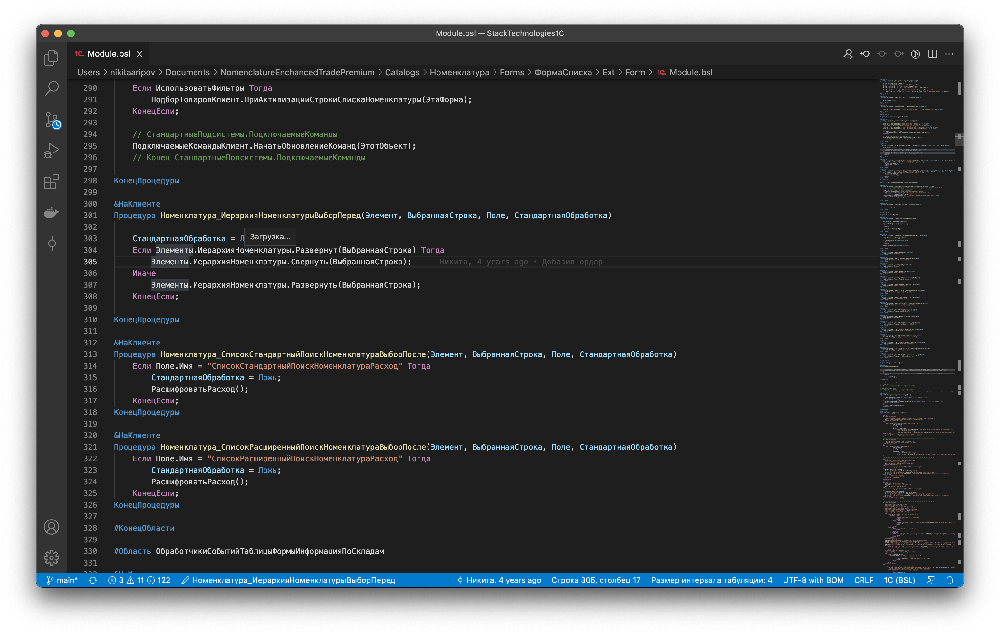​

**Зачем нужно:**

Может использоваться как редактор кода для около 1Сных технологий (OneScript, Vanessa и другие)

**Заметки:**

Удобный и гибкий редактор для кода. Есть плагины для подсветки синтаксиса 1С и проверки модулей.

Полноценную разработку приложений на 1С в нем вести скорее нельзя, зато можно использовать для удобного просмотра модулей.

Широко используется для других языков. Можно использовать для OneScript и Vanessa.

Имеет очень много расширений, которые могут существенно улучшить работу.

**С чего начать:**

1. Статья - [Подробный гайд для начинающих](https://habr.com/ru/post/490754/)
2. Плагин - [Поддержка языка 1С:Предприятие 8 (BSL)](https://github.com/1c-syntax/vsc-language-1c-bsl)

**Подробнее:**

1. Официальный сайт - <https://code.visualstudio.com>
2. Веб-версия редактора - <https://vscode.dev>

[В начало](#стек-технологий-для-1с)

## Плагины

Плагины, которые помогают в разработке на языках 1С

### Снегопат

Программный комплекс для 1С-программистов, который делает работу в Конфигураторе 1С удобнее и продуктивнее, улучшая контекстную подсказку и добавляя много новых возможностей.

Основные функции:

- Улучшение встроенной в Конфигуратор контекстной подсказки
- Подключение дополнительных аддинов от сторонних разработчиков
- Остальные разные "плюшки"

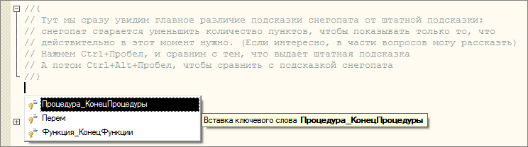​

**Зачем нужно:**

Улучшает работу в Конфигураторе 1С.

**С чего начать:**

1. Триальная версия на 3 месяца - [Снегопат - расширение Конфигуратора 8.2/8.3](https://infostart.ru/public/102065/)
2. Статья - [Установка и настройка Снегопат](https://infostart.ru/1c/articles/1286412/)
3. Статья - [Снегопат - Dev или Ops](https://infostart.ru/1c/articles/1279858/)

**Подробнее:**

1. Официальный сайт - <https://snegopat.ru>
2. Исходный код - <https://github.com/infostart-hub/snegopat>
3. Документация - <https://github.com/infostart-hub/snegopat/blob/master/docs/readme.md>
4. Официальный канал в Телеграме - <https://t.me/snegopat>

[В начало](#стек-технологий-для-1с)

### Подсистема "Инструменты разработчика"

Интегрированный набор инструментов разработчика: консоль кода, консоль запросов, консоль построителя отчетов, консоль компоновки данных, консоль заданий, конструктор запроса, справочник алгоритмов, исследователь объектов, интерфейсная панель, настройка журнала регистрации, анализ журнала регистрации, настройка техножурнала, анализ техножурнала, подбор и обработка объектов, редактор объекта БД, редактор констант, редактор параметров сеанса, редактор изменений по плану обмена, редактор пользователей, редактор предопределенных, редактор хранилищ настроек, динамический список, поиск дублей и замена ссылок, контекстная подсказка, синтакс-помощник, поиск битых ссылок, поиск ссылок на объект, структура хранения БД, удаление объектов с контролем ссылок, и прочее

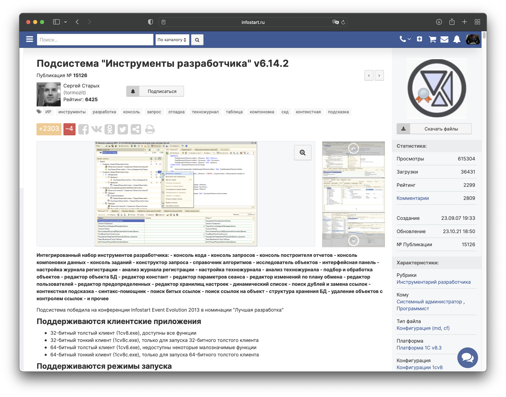​

**Зачем нужно:**

Набор инструментов разработчика, который помогает в ежедневной работе.

**С чего начать:**

1. Публикация на Инфостарт - <https://infostart.ru/public/15126/>

**Подробнее:**

1. Официальный сайт - <http://devtool1c.ucoz.ru>

[В начало](#стек-технологий-для-1с)

### Подсистема "Универсальные инструменты 1С для управляемых форм"

Интегрированный набор инструментов разработчика: групповая обработка справочников и документов, редактор констант, структура хранения базы данных, Удаление помеченных объектов, Консоль запросов, Консоль заданий, Регистрация изменений для обмена, Поиск и удаление дублей, Консоль кода, Поиск ссылок на объект, Редактор реквизитов объекта, Консоль отчетов, Динамический список, Консоль HTTP запросов, Выгрузка загрука XML с фильтрами, Навигатор по конфигурации, Файловый менеджер, Конструктор регулярных выражений, Консоль вебсервисов, Консоль сравнения данных, Информация о лицензиях 1С, Загрузка данных из табличного докумнета, Редактор JSON, Редактор HTML, Универсальный обмен данными в формате XML (с фильтрами и прямой загрузкой через HTTP сервис), Редактор СКД, Сравнение объектов, Библиотека сериализации 1С, Коннектор: удобный HTTP-клиент для 1С:Предприятие 8.
​
Поддерживаемые платформы
8.3.12 и выше

**Зачем нужно:**

Набор инструментов разработчика, который помогает в ежедневной работе (используется для управляемых форм)

**С чего начать:**

1. Исходный код  - <https://github.com/cpr1c/tools_ui_1c/>

[В начало](#стек-технологий-для-1с)

### Плагин для конфигуратора PhoenixBSL

Проект позволяет анализировать и форматировать код 1С в конфигураторе. Инструмент основан на проекте BSL LS.

​

**Зачем нужно:**

Быстрая проверка на соответствие стандарта кода в конфигураторе.

**С чего начать:**

1. Исходный код - <https://github.com/otymko/phoenixbsl>

[В начало](#стек-технологий-для-1с)

### Плагины для 1С:EDT

1С:EDT позволяет дополнить стандартный инструментарий среды с помощью плагинов.

Официальные плагины от 1С:

- [1С:Language Tool](https://its.1c.ru/db/edtplugins#bookmark:languagetool:LanguageTool) - инструмент перевода исходного кода и локализации интерфейса
- [1C:SSL-support](https://its.1c.ru/db/edtplugins#bookmark:sslsupport:SSLsupport) - поддержка разработки конфигураций на базе Библиотеки Стандартных Подсистем
- [1С:Стандарты разработки V8](https://its.1c.ru/db/edtplugins#bookmark:v8codestyle:V8CodeStyle) - разработка по стандартам 1С, проверки, инструменты

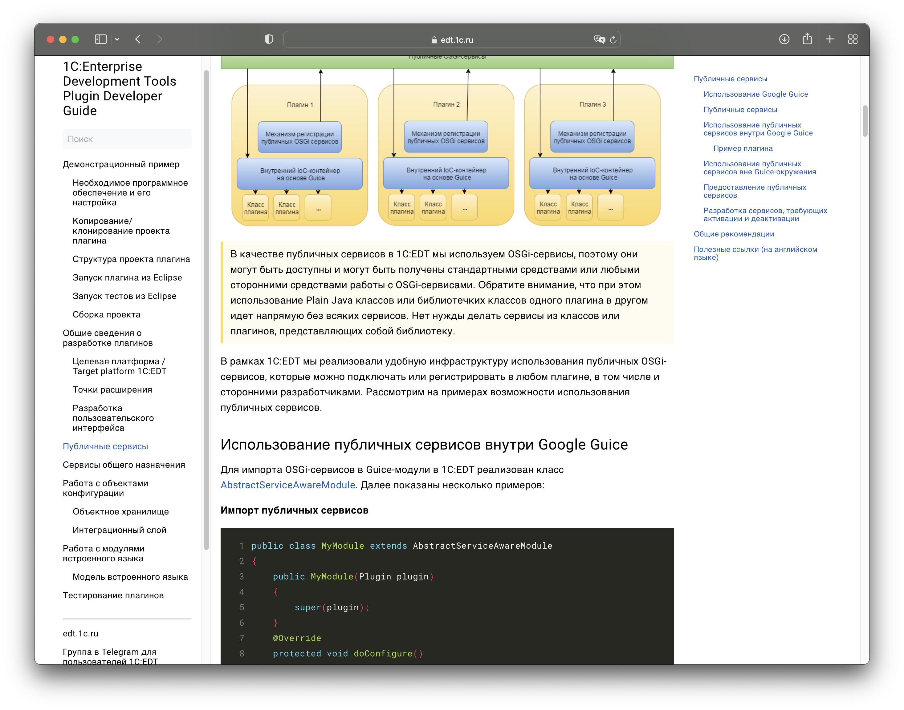​

**Зачем нужно:**

Улучшают работу разработчика в 1C:EDT

**Заметки:**

Документация 1С:EDT содержит отдельный блок про разработку плагинов и точки расширения, чтобы было проще начать.

Это перспективное направление, которое позволит в дальнейшем существенно упростить работу со средой разработки.
Фирма "1С" поддерживается начинания в этом направлении.

**С чего начать:**

1. Статья - [Список плагинов, которые можно/нужно использовать в 1C:EDT](https://github.com/marmyshev/edt-plugins)
2. Статья - [Как сделать плагин для 1С:EDT для начинающего](https://infostart.ru/1c/articles/1311121/)

**Подробнее:**

1. Официальный сайт - <https://edt.1c.ru/ext/>
2. Документация разработчика плагинов - <https://edt.1c.ru/dev/ru/>
3. Документация по официальным плагинам - <https://its.1c.ru/db/edtplugins>

[В начало](#стек-технологий-для-1с)

# Системы хранения версий

Используются для облегчения работы с изменяющейся информацией. Система управления версиями позволяет хранить несколько версий одного и того же документа, при необходимости возвращаться к более ранним версиям, определять, кто и когда сделал то или иное изменение, и многое другое.

Широко используются при командной разработке.

## Хранилище

Хранилище конфигурации предназначено для коллективной разработки конфигурации. Представляет собой базу данных, в которой сохраняются все изменения конфигурации, сделанные в процессе ее разработки.
Четыре простейшие операции работы с хранилищем:

- Захват объекта
- Помещение объекта
- Получение объекта
- Отмена захвата

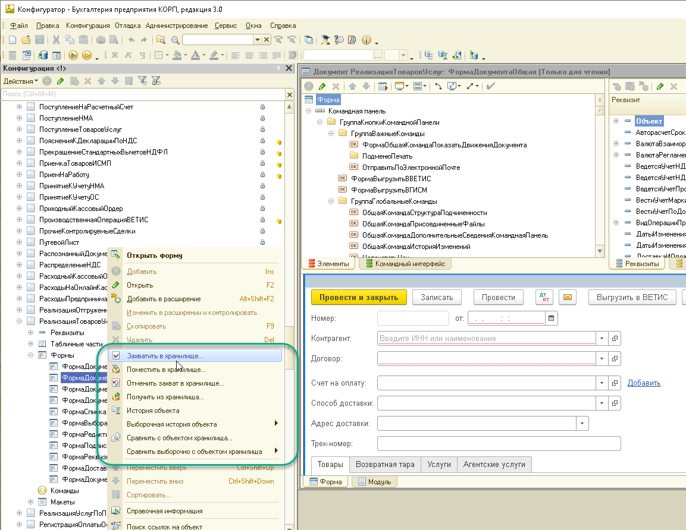​

**Зачем нужно:**

Используется для командной разработки, чтобы отслеживать версии кода. Используется при разработке в Конфигураторе.

**Заметки:**

Имеет смысл использовать и для разработки одним программистом, чтобы хранить изменения. При необходимости можно вернуться к конкретной версии объекта.

**С чего начать:**

1. Статья - [Работа с хранилищем конфигурации в 1С](https://programmist1s.ru/hranilishhe-konfiguratsii-1s/)
2. Статья - [Важные вопросы про хранилище конфигурации](https://курсы-по-1с.рф/articles/статьи-хранилище-конфигурации/)

**Подробнее:**

1. Документация - <https://its.1c.ru/db/metod8dev#content:2287:hdoc>

[В начало](#стек-технологий-для-1с)

## git

Распределенная система управления версиями. Основное отличие Git’а от любой другой системы контроля версий (включая хранилище конфигурации) - это подход Git’а к работе со своими данными. Концептуально, большинство других систем хранят информацию в виде списка изменений в файлах.

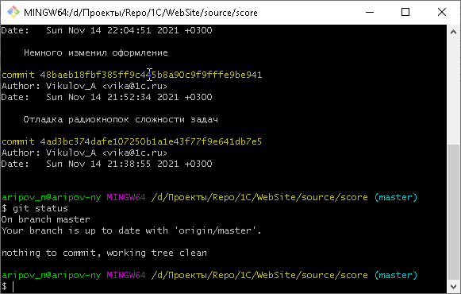​

**Зачем нужно:**

Используется для командной разработки, чтобы отслеживать версии кода. Используется при разработке в 1C:EDT.

**Заметки:**

Git - система хранения версий для 1C:EDT.

Стоит различать git и удаленные репозитории, например, GitHub и GitLab.
Удаленные репозитории используются для размещения git репозиториев не отдельном сервере или в облаке .

Имеет смысл выучить основные команды для работы через консоль, так как порой это быстрее, проще и надежнее, чем через специальные инструменты.

Для постепенного перехода на можно использовать выгрузки хранилища в git, например, 1С:Гитконвертер или gitsync.

**С чего начать:**

1. Документация [1С:EDT о git](https://edt.1c.ru/upload/docs_git/topics/t000001.html)
2. Статья - [Github и 1С. Пошаговая инструкция на примере](https://infostart.ru/1c/articles/691382/)
3. Статья - [Git-flow в 1С](https://infostart.ru/1c/articles/310640/)

**Подробнее:**

1. Документация git - <https://git-scm.com/book/ru/v2>
2. Документация 1С:ГитКонвертер - <https://its.1c.ru/db/metod8dev#content:5937:hdoc>
3. Официальный профиль 1С на Github - <https://github.com/1C-Company>

[В начало](#стек-технологий-для-1с)

# Прототипирование

Прототипирование позволяет минимальными усилиями подготовить вариант для согласования с заказчиком.

## 1CMaker

Онлайн-сервис для UI и UX дизайна решений на базе 1С:Предприятие.

Преимущества:

1. Простой конструктор, без программирования
2. Упрощает понимание и согласование с заказчиком
3. Не требует установки и лицензии 1С

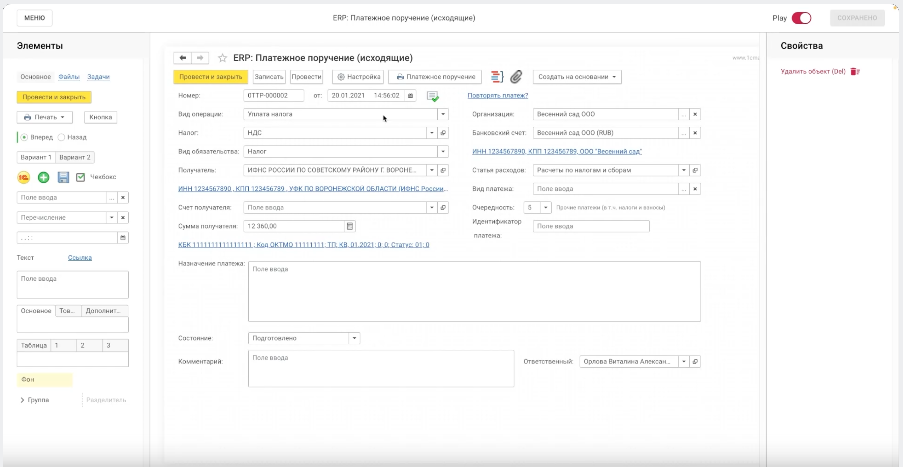​

**Зачем нужно:**

Позволяет быстро накидать форму, чтобы согласовать ее с заказчиком. Легко вносить изменения и не жалко выкинуть.

**Заметки:**

Очень полезный инструмент для того, чтобы быстро и просто рисовать прототип формы. Такой прототип легко показать заказчику, легко внести изменения по результатам обсуждения. А после согласования формы по прототипу уже можно разрабатывать в конфигураторе или EDT.

Есть аналоги, которые не заточены под 1С, но в них все равно можно рисовать формы, например mockplus, moqups и другие.

**С чего начать:**

1. Видео - [Инструмент быстрого прототипирования форм 1С](https://www.youtube.com/watch?v=ClXimHTYdYE)

**Подробнее:**

1. Официальный сайт - <https://1cmaker.com/>

[В начало](#стек-технологий-для-1с)

# Повышение качества

В данном разделе собраны инструменты и советы для повышения качества разрабатываемых продуктов. Могут быть полезны как для командной разработки, так и для индивидуальной.

## Автоматизированное тестирование

Это часть процесса тестирования на этапе контроля качества в процессе разработки программного обеспечения. Оно использует программные средства для выполнения тестов и проверки результатов выполнения, что помогает сократить время тестирования и упростить его процесс.

### 1С:Тестировщик и 1С:Сценарное тестирование

Программные инструменты для тестирования конфигураций, созданных на платформе "1С:Предприятие". Позволяет автоматизировать проектирование тестов, выполнение тестирования и анализ полученных результатов.

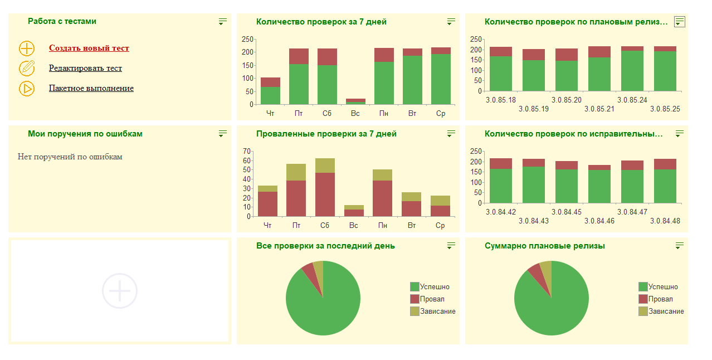​

**Зачем нужно:**

Используется для разработки и запуска автоматизированных тестов, чтобы вручную не проверять одни и те же сценарии.

**Заметки:**

Это инструменты от вендора, которые позволяют готовить и выполнять тесты. 1С:Сценарное тестирование используется для тестирования типовой конфигурации 1С:Бухгалтерия предприятия.

1С:Сценарное тестрование входит в состав Корпоративного инструментального пакета. Отдельно его купить и попробовать, к сожалению, нельзя.

Для ознакомления с возможностями предназначен 1С:Тестировщик - это легкая версия программного продукта.

**С чего начать:**

1. Канал на YouTube - [1С:Сценарное тестирование](https://www.youtube.com/channel/UCbdRui0PGMp9lqhvnVJcRzA)
2. Вебинар ["1С:Сценарное тестирование 3.0. Примеры"](https://www.youtube.com/watch?v=9LppwC6gQTA)

**Подробнее:**

1. Описание - <https://v8.1c.ru/tekhnologii/tekhnologii-krupnykh-vnedreniy/korporativnyy-instrumentalnyy-paket/1c-stsenarnoe-testirovanie/>
2. Документация - <https://its.1c.ru/db/kip/content/66/hdoc>

[В начало](#стек-технологий-для-1с)

### Vanessa-Automation и Vanessa-ADD

Набор инстурментов для проверки качества решений на платформе 1С:Предприиятие.
Позволяют проверять поведение различных систем на базе платформы 1С.

Возможности:

- Готовые "дымовые тесты" различных видов
- Различные виды тестирования
- Проверка поведения
- Формирование автодокументации

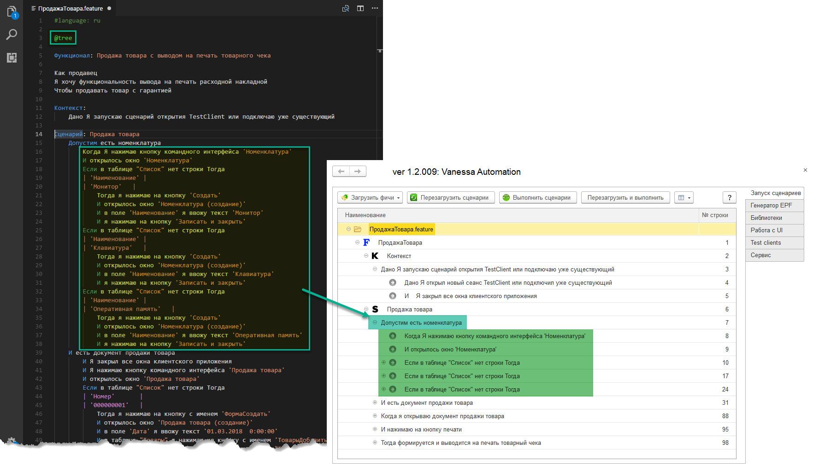​

**Зачем нужно:**

Позволяет разрабатывать и запускать тесты, автоматически подготовливает инструкции и документацию.

**Заметки:**

Набор инструментов для тестирования прикладных решений. Пользуется большой популярностью в среде 1С.
Используется для тестирования типовой конфигурации 1С:ERP. Тесты публикуются для партнеров на портале 1С.

Open-source проекты с живым и общительным сообществом. Можно задать вопрос и получить адекватный ответ.

Vanessa-Automation и Vanessa-ADD развиваются параллельно, но имеют общие принципы и подходы. Поэтому можно выбрать любой по своему вкусу.

В состав Vanessa-ADD входит набор инструментов для написания unit-тестов.

**С чего начать:**

1. Статья - [Инструмент тестирования прикладных решений на платформе 1С](https://habr.com/ru/post/418303/)
2. Статья - [Разработка и сценарное тестирование с Vanessa](https://infostart.ru/1c/articles/969637/)
3. Группа в телеграмм - <https://t.me/testspro1c>

**Подробнее:**

1. Документация Vanessa-Automation - <https://pr-mex.github.io/vanessa-automation/>
2. Исходные коды Vanessa-Automation - <https://github.com/Pr-Mex/vanessa-automation>
3. Документация Vaness-ADD - <https://github.com/vanessa-opensource/add/blob/develop/doc/README.md>
4. Исходные коды Vanessa-ADD - <https://github.com/vanessa-opensource/add>

[В начало](#стек-технологий-для-1с)

## Статический анализ кода

Это анализ программного обеспечения, производимый (в отличие от динамического анализа) без реального выполнения исследуемых программ.

### Синтаксическая проверка конфигурации

Встроенная в конфигуратор и EDT проверка конфигурации. Расширенная проверка позволяет находить не только ошибки компиляции модулей.

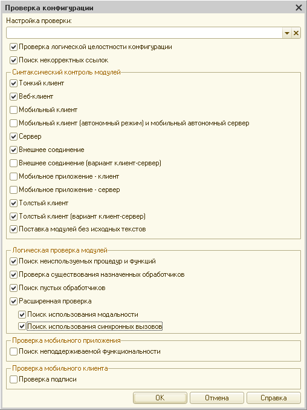​

**Зачем нужно:**

Механизм проверки конфигурации позволяет выявить ошибки, которые не являются критичными для функционирования прикладного решения в принципе, но наличие которых может существенно снизить скорость работы прикладного решения или даже привести к возникновению ошибок при работе в некоторых специальных режимах.

**Заметки:**

Если нет автоматизации, то имеет смысл делать эту проверку на завершающем этапе разработки, чтобы исправить потенциальные ошибки.

**Подробнее:**

1. Документация - <https://its.1c.ru/db/metod8dev/content/2290/hdoc>

[В начало](#стек-технологий-для-1с)

### 1С:Автоматизированная проверка конфигураций

Предназначена для автоматизированной проверки конфигураций, разработанных на платформе «1С:Предприятие 8», на соответствие стандартам и иным требованиям технического характера

Основные возможности:

1. Разовая проверка на соответствие стандартам разработки
2. Регулярная автоматическая проверка на соответствие стандартам разработки
3. Сравнение качества различных конфигураций
4. Расширяемость

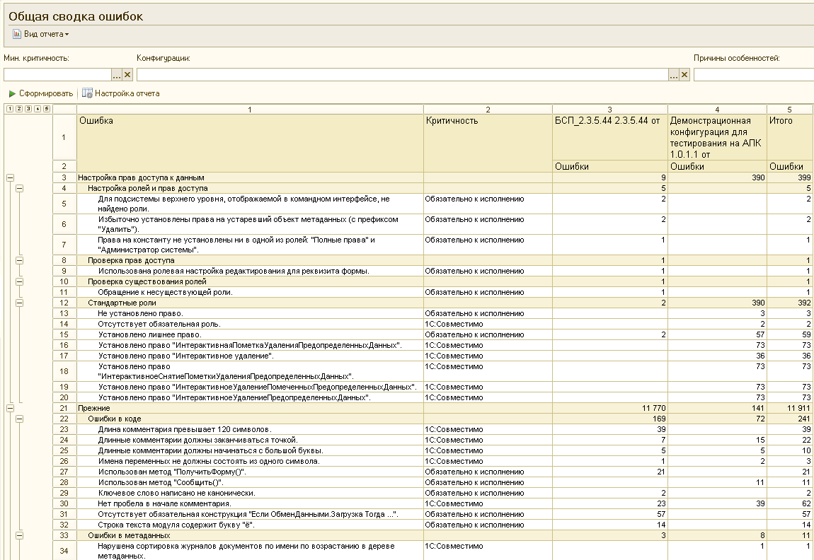​

**Зачем нужно:**

Используется для проверки решений на соответствие стандартам. Обязательно применяется при сертификации 1С:Совместимо.

**Заметки:**

Большая, тяжелая и медленная система, которая выдает очень много ошибок даже для типовых конфигураций. Есть специальные доработки, которые позволяют передавать результат проверки в SonarQube.

**С чего начать:**

1. Статья - [Автоматизированная проверка конфигураций…](https://infostart.ru/1c/articles/574829/)

**Подробнее:**

1. Официальный сайт - <http://v8.1c.ru/acc/>

[В начало](#стек-технологий-для-1с)

### Плагин для SonarQube

Поддержка языка 1С:Предприятие 8 и OneScript для SonarQube. SonarQube - платформа для непрерывного анализа и измерения качества программного кода.

Возможности:

- Дашборд проекта
- Подсветка синтаксиса 1С:Предприятие
- Расчет базовых метрик и количества строк кода
- Регистрация диагностик, предоставляемых BSL Language Server как внутренних правил
- Встроенный анализатор - BSL Language Server Diagnostic provider
- Импорт результатов внешних анализаторов во внутреннем формате json

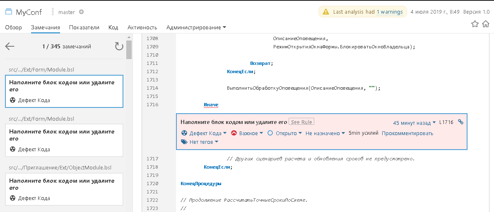​

**Зачем нужно:**

Используется для непрерывной оценки качества кода и управления техническим долгом.

**Заметки:**

Прекрасный инструмент, который показывает замечания с привязкой к конкретной строчке кода и, соответственно, автору. Позволяет отслеживать замечания и ошибки только в новом коде. Это удобно, так как мы можем прямо сейчас стараться не допускать новых замечаний и постепенно разбираться со старыми.

Из коробки 1С не поддерживает, но есть, как минимум, два плагина для 1С:

- [SonarQube 1C (BSL) Community Plugin](https://github.com/1c-syntax/sonar-bsl-plugin-community) - open source решение (бесплатно)
- [SONARQUBE 1C (BSL) Plugin](https://silverbulleters.org/sonarqube)  - решение от SilverBulleters

Также позволяет использовать внешние анализаторы, такие как Синтаксическая проверка конфигурации или АПК.

**С чего начать:**

1. Статья - [Управляй качеством кода 1С с помощью SonarQube](https://infostart.ru/1c/articles/1089670/)
2. Статья - [Как управлять качеством кода 1С, используя платформу SonarQube](https://infostart.ru/1c/articles/1175305/)
3. Статья - [Управление качеством кода](https://infostart.ru/1c/articles/1096770/)

**Подробнее:**

1. Официальный сайт Community Plugin - <https://1c-syntax.github.io/sonar-bsl-plugin-community/>
2. Исходный код Community Plugin - <https://github.com/1c-syntax/sonar-bsl-plugin-community>
3. SONARQUBE 1C (BSL) Plugin - <https://silverbulleters.org/sonarqube>

[В начало](#стек-технологий-для-1с)

## Прочее

Полезные инструменты и практики для повышения качества разрабатываемых решений.

### Code-review

Термин “code review” может означать разные действия, от простого чтения какого-то кода из-за спины разработчика до совещания на 20 человек, где вы разбираете код строчка за строчкой.

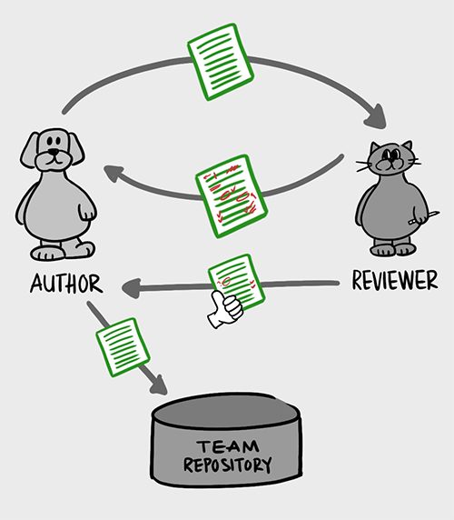​

**Зачем нужно:**

Помогает повысить сопровождаемость и качества разработки.

**Заметки:**

Считаю Code-review одним из самых ценных инструментов для повышения качества, так как позволяет, и совместно владеть кодом и в будущем легче его сопровождать. Применяя code-review мы стараемся код писать понятнее, так как его точно посмотрят.

Для проведения Code-review не обязательно применять дополнительные инструменты, порой достаточно посмотреть в конфигураторе код коллеги и написать замечания либо прямо в коде, либо в отдельном файле.

Тем не менее для Code-review есть и различные инструменты, которые позволяют упростить этот процесс. Самый простой способ - это использование удаленных репозиториев и создание запросов на слияние, который кто-то посмотрит. Существуют также и отдельные инструменты, например Upsource от JetBraind или Crucible от Atlassian.

**С чего начать:**

1. Статья - [Code review по-человечески](https://habr.com/ru/post/340550/)
2. Статья - [Как завести у себя в команде код-ревью](https://infostart.ru/1c/articles/1093475/)
3. Статья - [Инструменты для Code-review](https://phpprofi.ru/blogs/post/108)

**Подробнее:**

1. Официальный сайт Upsource - <https://www.jetbrains.com/upsource/>
2. Официальный сайт Crucible - <https://www.atlassian.com/ru/software/crucible>

[В начало](#стек-технологий-для-1с)

### Стандарты разработки

Система стандартов и методики разработки конфигураций для платформы 1С:Предприятие 8.

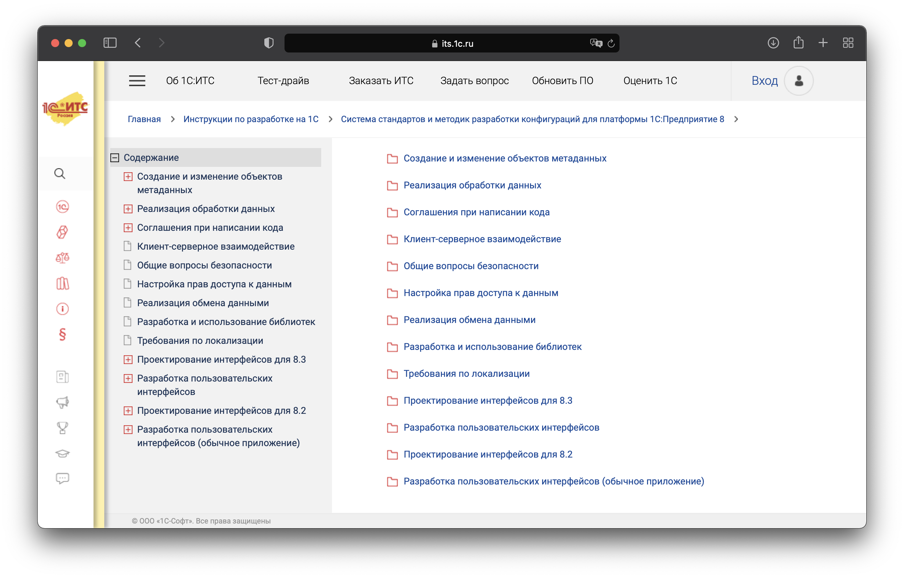​

**Зачем нужно:**

Система стандартов описывает как правильно писать код, чтобы он был качественный и производительный.

**Заметки:**

Отличные рекомендации по коду от вендора, следование которым убережет вас от большинства ошибок и потерь производительности. Содержит исчепывающие примеры как делать правильно и как делать не стоит.

Существуют автоматические проверки кода на следование стандартам.

**С чего начать:**

1. Документация - [Система стандартов](https://its.1c.ru/db/v8std)

[В начало](#стек-технологий-для-1с)

# CI/CD

Непрерывная интеграция (Continuous Integration, CI) и непрерывная поставка (Continuous Delivery, CD) представляют собой культуру, набор принципов и практик, которые позволяют разработчикам чаще и надежнее развертывать изменения программного обеспечения.

Continuous Integration позволяет непрервывно тестировать продукт и находить ошибки сразу после закладки или коммита. Благодаря этому можно исправить ошибку меньшими усилиями, потому что вы в контексте.

## Jenkins

Jenkins — программная система, предназначенная для обеспечения процесса непрерывной интеграции программного обеспечения. Позволяет автоматизировать часть процесса разработки программного обеспечения, в котором не обязательно участие человека.

Основные плюсы:

1. Простая установка
2. Простая настройка
3. Расширения и плагины

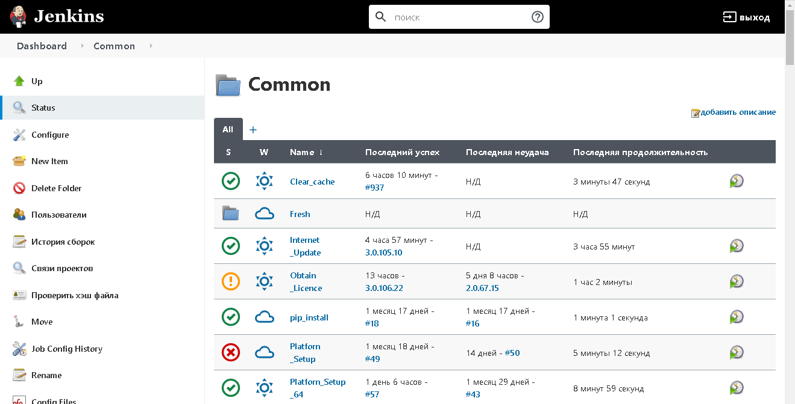​

**Зачем нужно:**

Нужен для разворачивания системы непрерывной интеграции.

**Заметки:**

Кажется, что это самый простой и доступный способ познакомиться с CI/CD. Полно примеров на 1С и не только как настроить и запустить. Если хотите с чего-то начать, то Jenkins - самое то.

**С чего начать:**

1. Стрим - [Сборочная линия с нуля](https://youtu.be/86wJ-ldntAo)
2. Статья - [Переводим рутину ручного тестирования 1C на рельсы Jenkins-а](https://infostart.ru/public/1070720/)
3. Статья - [Конвеер проверки качества кода](https://infostart.ru/public/1117485/)
4. Исходный код - [Библиотека Jenkins для 1С](https://github.com/firstBitSemenovskaya/jenkins-lib)

**Подробнее:**

1. Официальный сайт - <https://www.jenkins.io>

[В начало](#стек-технологий-для-1с)

## Gitlab CI

Система непрерывной интеграции, входящая в состав Gitlab. Позволяет легко привязывать сборочную линию к коммитам репозитория.

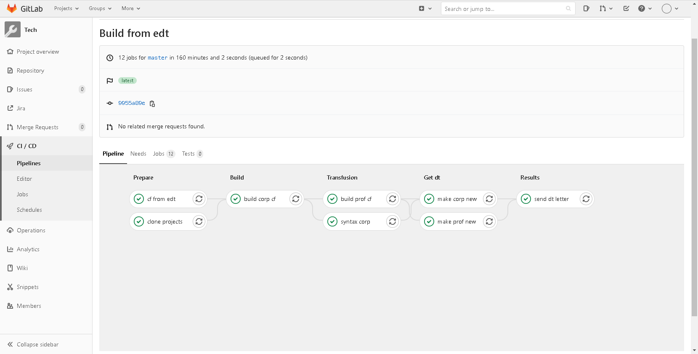​

**Зачем нужно:**

Для запуска тестов при каждой закладке в хранилище или репозиторий.

**Заметки:**

Кажется, что имеет смысл использовать Gitlab CI если у вас уже используется Gitlab в качестве удаленного репозитория.

Позволяет запускать процессы как к привязке к конкретному коммиту, так и просто по расписанию.

Можно использовать бесплатную версию Gitlab на официальном сайте.

Если используете другие системы, то можно рассмотреть аналоги, такие как Github Action или Travis CI.

**С чего начать:**

1. Статья - [Введение в GitLab CI](https://habr.com/ru/company/softmart/blog/309380/)
2. Статья - [Как Gitlab-CI и OneScript могут отсортировать массив (Часть 1)](https://infostart.ru/1c/articles/1552117/)
3. Статья - [Руководство по CI/CD в GitLab для новичка](https://habr.com/ru/post/498436/)

**Подробнее:**

1. Официальный сайт - <https://gitlab.com>
2. Документация на английском - <https://docs.gitlab.com/ee/ci/>

[В начало](#стек-технологий-для-1с)

## Vagrant

Vagrant — позволяет создавать и конфигурировать легковесные, повторяемые и переносимые окружения для разработки.

Возможности:

1. Изолированные среды. Избегаются возможные конфликты с основной системой
2. Повторяемость. Можно быстро пересоздать рабочую среду буквально одной командой
3. Переносимость. Окружение можно развернуть под любой системой

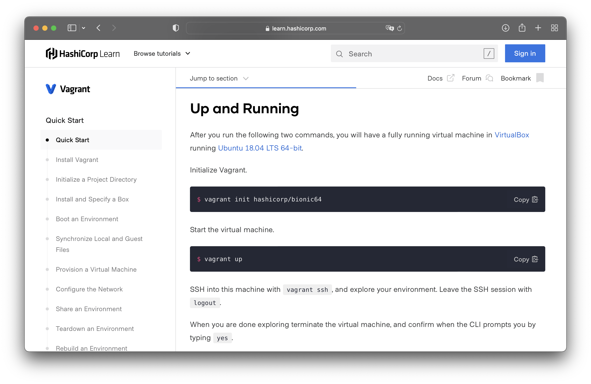​

**Зачем нужно:**

Позволяет на локальной машине создавать легко управляемые виртуальные среды. То есть можно легко в них установить необходимые инструменты.

**С чего начать:**

1. Статья - [Использование Vagrant и Ansible для разворачивания тестовой инфраструктуры](https://infostart.ru/1c/articles/1531329/)
2. Статья - [Использование Vagrant и Docker при разработке в 1С](https://infostart.ru/1c/articles/542836/)
3. Цикл статей - [Многопоточный CI-контур для 1С](https://infostart.ru/1c/articles/1198035/)
4. Статья - [Что такое Vagrant](https://guides.hexlet.io/vagrant/)

**Подробнее:**

1. Официальный сайт - <https://www.vagrantup.com>
2. Документация на английском - <https://learn.hashicorp.com/vagrant>

[В начало](#стек-технологий-для-1с)

## Docker

Это программное обеспечение для автоматизации развёртывания и управления приложениями в среде виртуализации на уровне операционной системы; позволяет «упаковать» приложение со всем его окружением и зависимостями в контейнер, а также предоставляет среду по управлению контейнерами.

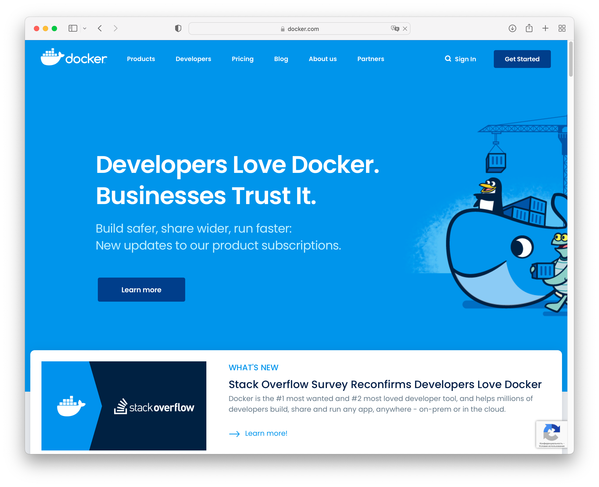​

**Зачем нужно:**

Позволяет разработчикам подготовить и запустить изолированные приложения со всеми зависимостями. Один раз подготовили контейнер со всем необходимым и дальше можете его использовать сколько угодно раз.

**Заметки:**

В мире 1С используется скорее для разворачивания тестовых контуров, чем для разработки. С помощью докера проще масштабировать систему - выделили новые ресурсы и просто подняли там докер (требует меньше ресурсов, чем виртуальная машина). Не нужно каждый раз настраивать все зависимости.

**С чего начать:**

1. Статья - [Полное практическое руководство по Docker](https://habr.com/ru/post/310460/)
2. Статья - [Использование Vagrant и Docker при разработке в 1С](https://infostart.ru/1c/articles/542836/)
3. Статья - [Создаем Docker-контейнер с 1С](https://infostart.ru/1c/articles/548179/)
4. Статья - [Тестируем в Docker](https://infostart.ru/1c/articles/1412427/)
5. Исходный код - [Образы контейнеров для 1С](https://github.com/firstBitSemenovskaya/onec-docker)

**Подробнее:**

1. Официальный сайт - <https://www.docker.com>

[В начало](#стек-технологий-для-1с)

## Allure

Инструмент для гибкого, легкого и красивого отображения результатов автотестов.

​

**Зачем нужно:**

Может показывать результаты тестов и различных проверок в красивом и аккуратном виде. Приятно посмотреть.

**Заметки:**

Этот инструмент не связан с разработкой и обычно используют в связке с Jenkins, чтобы отображать результаты выполнения автотестов.

Может работать одновременно со множеством источников данных, информацию о тестах следует передавать в специальный адаптер (например, Vaness-ADD умеет делать их самостоятельно). Может показывать историю выполнения конкретного теста.

**С чего начать:**

1. Статья - [Разработка и сценарное тестирование с Vanessa-ADD. Отчетность Allure](https://infostart.ru/1c/articles/1010127/)
2. Статья - [Allure 2: тест-репорты нового поколения](https://habr.com/ru/company/jugru/blog/337386/)
3. Статья - [Allure-Framework. Работа с кодом](https://habr.com/ru/company/sberbank/blog/359302/)

**Подробнее:**

1. Исходный код - <https://github.com/allure-framework/allure2/releases>
2. Документация на английском - <https://docs.qameta.io/allure/>

[В начало](#стек-технологий-для-1с)

# Интеграции

Интеграция данных — объединение данных, находящихся в различных источниках и предоставление данных пользователям в унифицированном виде.
1С довольно распространенная система, поэтому интеграции требуются часто. Важно делать их правильно, чтобы в будущем было проще поддерживать.

## 1С:Конвертация данных и EnterpriseData

Конвертация данных - это инструмент для разработки обменов, предполагающих наличие посредника передачи данных между конфигурациями в виде универсального формата данных EnterpriseData

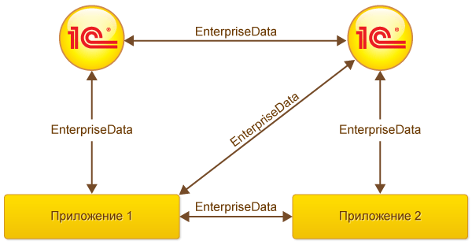​

**Зачем нужно:**

Конфигурация "Конвертация данных" позволяет создать правила обмена между различными системами в универсальном бизнес-ориентированном формате EnterpriseData.

**Заметки:**

Формат EnterpriseData позволяет загружать информацию из любых систем. То есть если нужно делать загрузку из какой-то внешней системы в 1С, то стоит делать ее в формате EnterpriseData, так как за загрузку будут отвечать типовые обработчики.

**С чего начать:**

1. Статья - [1С:Конвертация данных 3. Инструкции и примеры.](https://infostart.ru/1c/articles/695523/)
2. Статья - [Новый подход к обмену данными EnterpriseData](https://infostart.ru/1c/articles/963164/)

**Подробнее:**

1. Документация - <https://its.1c.ru/db/metod8dev/content/5846/hdoc>
2. Формат EnterpriseData - <https://v8.1c.ru/tekhnologii/obmen-dannymi-i-integratsiya/standarty-i-formaty/format-enterprisedata/>

[В начало](#стек-технологий-для-1с)

## Telegram бот

Боты — специальные аккаунты в Telegram, созданные для того, чтобы автоматически обрабатывать и отправлять сообщения. Пользователи могут взаимодействовать с ботами при помощи сообщений, отправляемых через обычные или групповые чаты.

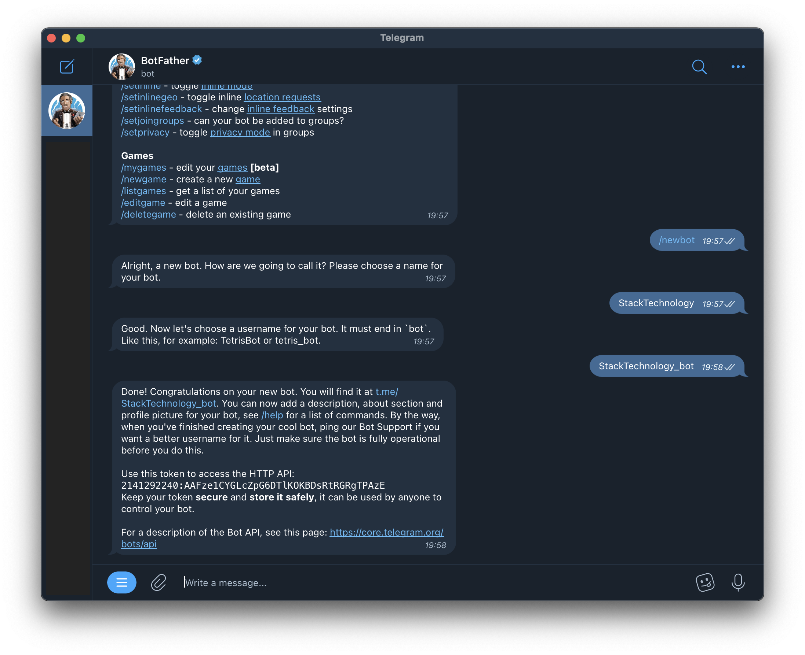​

**Зачем нужно:**

Для выполнения различных операций с помощью Telegram, начиная с интеграции с мессенджером или информированием о текущем состоянии фирмы и заканчивая ведением CRM.

**Заметки:**

Кажется, это один из самых распространенных и простых запросов на интеграцию. Удобство API Telegram позволяет создавать ботов без особых затрат.

Система взаимодействия может интегрироваться с Telegram ботом из коробки.

Есть специальная [платформа интеграции 1С с чат ботами](https://bots1c.ru)

Также в 1С:Управление нашей фирмой есть [функциональность по интеграцию с ботом](https://its.1c.ru/db/answers1c#content:1245:hdoc)

**С чего начать:**

1. Статья - [Пример связи 1С и мессенджера Telegram](https://infostart.ru/public/419846/)
2. Статья - [Создание телеграм бота в 1С](https://infostart.ru/1c/articles/932874/)
3. Статья - [Telemonitor - объединяем Telegram и 1С](https://infostart.ru/public/387433/)
4. Статья - [Опыт интеграции мессенджера Telegram c 1C](https://infostart.ru/1c/articles/819087/)
5. Статья - [Всё, о чём должен знать разработчик Телеграм-ботов](https://habr.com/ru/post/543676/)

**Подробнее:**

1. Документация - <https://tlgrm.ru/docs/bots>
2. BotFather - <https://t.me/botfather>

[В начало](#стек-технологий-для-1с)

## Брокеры сообщений (RabbitMQ, Kafka и другие)

Брокер сообщений — приложение, которое преобразует сообщение по одному протоколу от приложения-источника в сообщение протокола приложения-приёмника, тем самым выступая между ними посредником. Также выполняет маршрутизацию конкретному приемнику, сохранение сообщений. Использование брокеров сообщений позволяет разгрузить веб-сервисы в распределённой системе, так как при отправке сообщений им не нужно тратить время на некоторые ресурсоёмкие операции типа маршрутизации и поиска приёмников

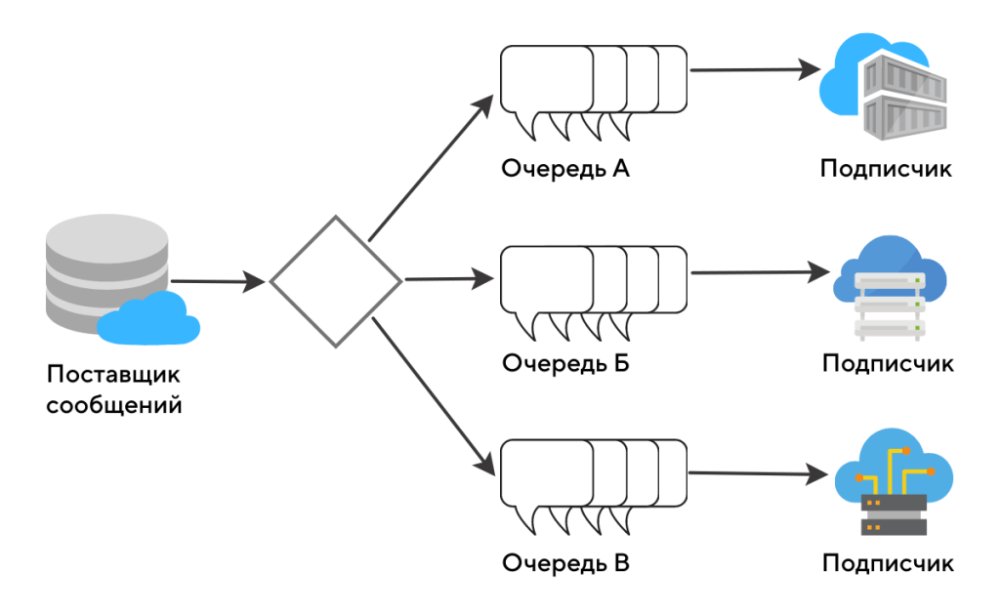​

**Зачем нужно:**

Позволяет быстро получать сообщения из разных источников, быстро перенаправлять сообщения в одну или несколько очередей согласно правилам маршрутизации, и обеспечивать быстрое чтение очередей по методу FIFO. Не нужно переживать, что сообщение не дошло.

**Заметки:**

Есть различные брокеры сообщений, так что можно выбрать подходящий именно под ваши задачи.

RabbitMQ — это гибкая маршрутизация сообщений между различными поставщиками и потребителями событий. В сервере реализована концепция принимающих события узлов (эксчейнджей) — они маршрутизируют данные в разные очереди сообщений RabbitMQ.

Apache Kafka — реализует архитектурную концепцию распределенного лога, в который заносят информацию разные поставщики данных. Затем информацию из этого лога читают другие программы и микросервисы. Сообщения сохраняются в брокере, подписчики подписываются на них, при этом гарантируется, что сообщения находятся в той же последовательности, в которой поступили.

**С чего начать:**

1. Статья - [Учимся готовить кроликов с редиской](https://infostart.ru/1c/articles/1234830/)
2. Статья - [RabbitMQ + Конвертация Данных 3.0](https://infostart.ru/1c/articles/692798/)
3. Статья - [1c + kafka.apache](https://infostart.ru/1c/articles/990211/)
4. Статья - [Apache Kafka: Основы технологии](https://habr.com/ru/company/southbridge/blog/550934/)
5. Статья - [RabbitMQ или Apache Kafka](https://zen.yandex.ru/media/mcs/rabbitmq-ili-apache-kafka-kakoi-broker-soobscenii-podoidet-dlia-vashego-proekta-601d6fab86f4e22208be5ff6)

**Подробнее:**

1. Официальный сайт RabbitMQ- <https://www.rabbitmq.com>
2. Официальный сайт Apache Kafka - <https://kafka.apache.org>

[В начало](#стек-технологий-для-1с)

## BI-системы

Системы бизнес-аналитики - это аналитические системы, которые объединяют данные из любых различных источников информации, обрабатывают их и предоставляют удобный интерфейс.

### 1С:Аналитика

1С:Аналитика — это BI-система, которая поможет вам в работе с аналитическими данными и отлично подойдет для управленческого учета

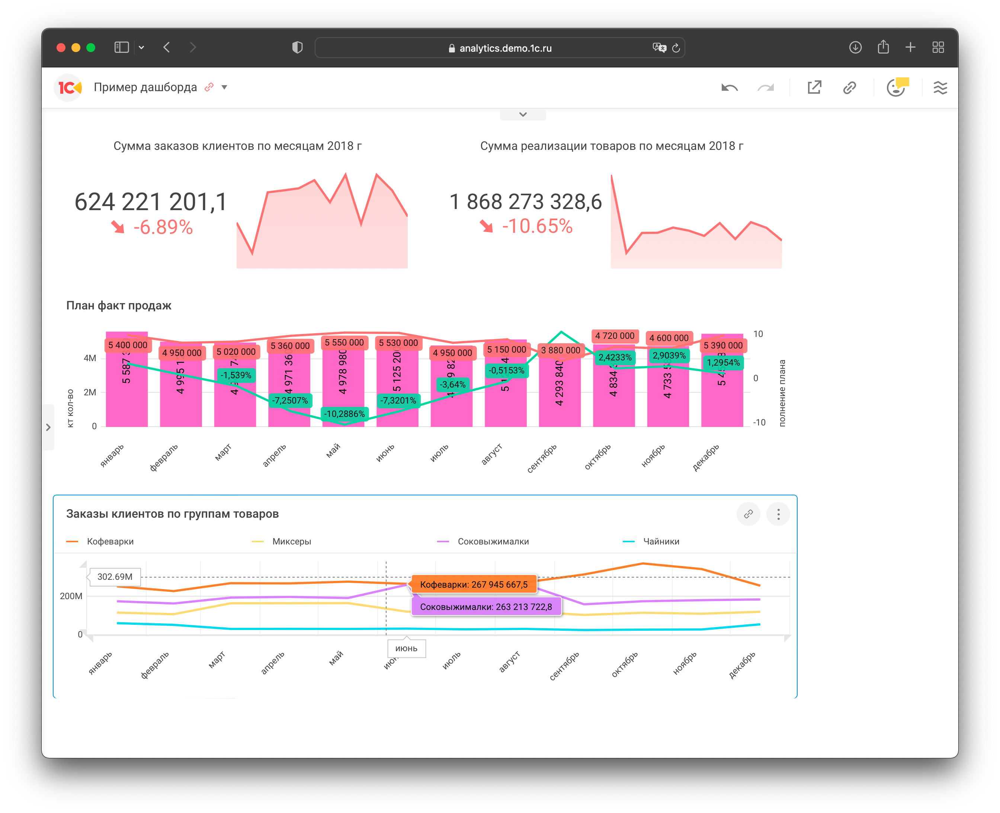​

**Зачем нужно:**

Простой и удобный интерфейс для бизнес-пользователей, который не требует специальных навыков или опыта работы с 1С

**Заметки:**

Позволяет строить красивые графики и дашборды по данным из 1С. Такие графики не стыдно показать руководителям.

Попробовать как это выглядит можно на [демонстрационном стенде](https://analytics.demo.1c.ru/analytics/ans) 1С:Аналитика

**С чего начать:**

1. Демонстрационный [стенд 1С:Аналитика](https://analytics.demo.1c.ru/analytics/ans)
2. Демонстрационные [видео по 1С:Аналитика](https://www.youtube.com/playlist?list=PLY7ViBfWFBOn-n7Bs4NRbc12h2bwKYLy1)
3. Книга - [Е. Ю. Хрусталева - 1С:Аналитика. BI-система в 1С:Предприятии 8](https://v8.1c.ru/metod/books/135703.htm)

**Подробнее:**

1. Официальный сайт - <https://v8.1c.ru/platforma/1s-analitika/>

[В начало](#стек-технологий-для-1с)

### Microsoft Power BI

Microsoft Power BI — это коллекция программных служб, приложений и соединителей, которые взаимодействуют друг с другом, чтобы превратить разрозненные источники данных в согласованные, визуально иммерсивные и интерактивные аналитические сведения.

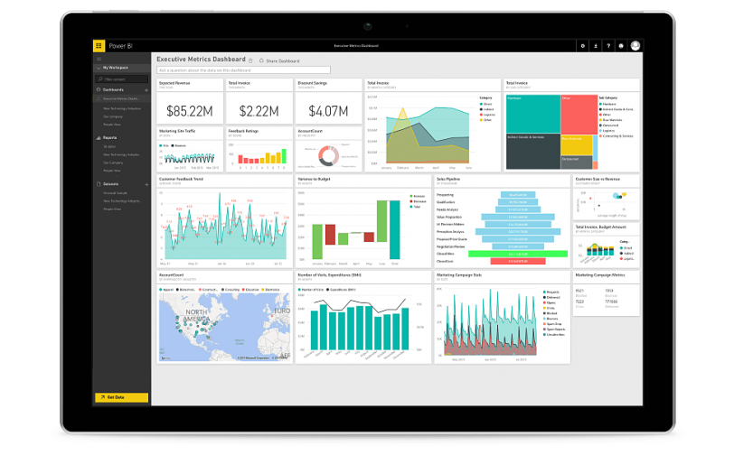​

**Зачем нужно:**

Позволяет собрать данные из 1C, Excel и других источников и построить красивые и понятные отчеты

**С чего начать:**

1. Статья - [Microsoft Power BI + 1С. Зачем и как?](https://infostart.ru/public/360077/)
2. Статья - [Как подружить 1С и Power BI](https://infostart.ru/1c/articles/914689/)
3. Статья - [Бизнес-аналитика с помощью Power BI](https://infostart.ru/1c/articles/1091360/)

**Подробнее:**

1. Официальный сайт - <https://powerbi.microsoft.com/ru-ru/>

[В начало](#стек-технологий-для-1с)

# Благодарность

Если статья была полезная или просто хотите поддержать автора,
то можете [купить мне кофе](https://yoomoney.ru/to/410011910320096)
