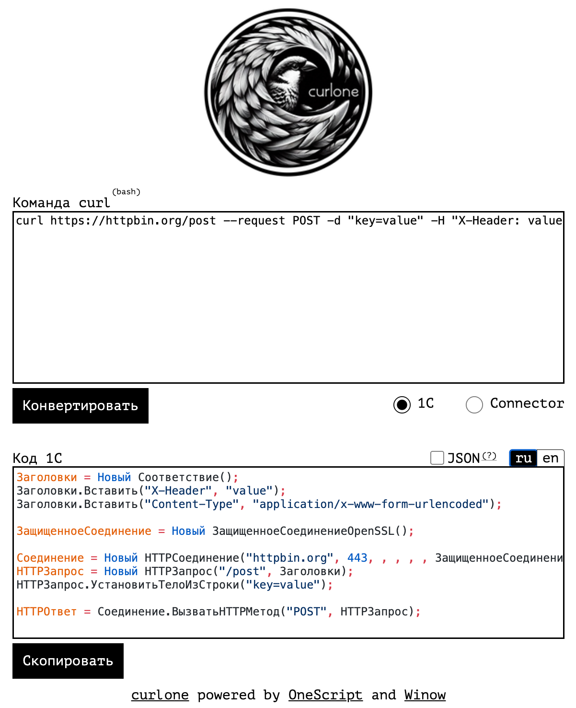

  

# Стек технологий для 1С

Стек технологий, которые могут быть полезны разработчику на 1С и около 1С.
По каждой технологии постарался объяснить зачем она нужна и с чего начать изучение, если заинтересует.

- [Стек технологий для 1С](#стек-технологий-для-1с)
- [Разработка](#разработка)
  - [Языки программирования](#языки-программирования)
    - [Встроенный язык программирования 1С:Предприятия](#встроенный-язык-программирования-1спредприятия)
    - [Язык запросов](#язык-запросов)
    - [Платформа для мобильных устройств](#платформа-для-мобильных-устройств)
    - [1С:Исполнитель](#1сисполнитель)
    - [1С:Предприятие.Элемент](#1спредприятиеэлемент)
    - [OneScript](#onescript)
  - [IDE](#ide)
    - [Конфигуратор](#конфигуратор)
    - [1C:Enterprise Development Tools (EDT)](#1centerprise-development-tools-edt)
    - [Visual Studio Code (VSCode)](#visual-studio-code-vscode)
  - [Плагины и библиотеки](#плагины-и-библиотеки)
    - [TurboConf](#turboconf)
    - [Подсистема "Инструменты разработчика"](#подсистема-инструменты-разработчика)
    - [Подсистема "Универсальные инструменты 1С для управляемых форм"](#подсистема-универсальные-инструменты-1с-для-управляемых-форм)
    - [Infostart Toolkit](#infostart-toolkit)
    - [Плагин для конфигуратора PhoenixBSL](#плагин-для-конфигуратора-phoenixbsl)
    - [Плагин 1С:Напарник](#плагин-1снапарник)
    - [Плагины для 1С:EDT](#плагины-для-1сedt)
    - [Библиотеки для OneScript](#библиотеки-для-onescript)
      - [Autumn (ОСень)](#autumn-осень)
- [Системы управления базами данных (СУБД)](#системы-управления-базами-данных-субд)
  - [Файловая СУБД](#файловая-субд)
  - [PostgreSQL](#postgresql)
  - [Microsoft SQLServer](#microsoft-sqlserver)
- [Системы хранения версий](#системы-хранения-версий)
  - [Хранилище](#хранилище)
  - [git](#git)
- [Прототипирование](#прототипирование)
  - [MAKER-STUDIO](#maker-studio)
  - [Накидка](#накидка)
- [Повышение качества](#повышение-качества)
  - [Автоматизированное тестирование](#автоматизированное-тестирование)
    - [1С:Тестировщик и 1С:Сценарное тестирование](#1стестировщик-и-1ссценарное-тестирование)
    - [Vanessa-Automation и Vanessa-ADD](#vanessa-automation-и-vanessa-add)
    - [Тестер](#тестер)
    - [YAxUnit](#yaxunit)
  - [Статический анализ кода](#статический-анализ-кода)
    - [Синтаксическая проверка конфигурации](#синтаксическая-проверка-конфигурации)
    - [1С:Автоматизированная проверка конфигураций](#1савтоматизированная-проверка-конфигураций)
    - [Плагин для SonarQube](#плагин-для-sonarqube)
  - [Прочее](#прочее)
    - [1С:СППР](#1ссппр)
    - [Code-review](#code-review)
    - [Стандарты разработки](#стандарты-разработки)
- [CI/CD](#cicd)
  - [Jenkins](#jenkins)
  - [Gitlab CI](#gitlab-ci)
  - [Vagrant](#vagrant)
  - [Docker](#docker)
  - [Allure](#allure)
- [Интеграции](#интеграции)
  - [1С:Конвертация данных и EnterpriseData](#1сконвертация-данных-и-enterprisedata)
  - [1С:Шина](#1сшина)
  - [Открытый пакет интеграций](#открытый-пакет-интеграций)
  - [Telegram бот](#telegram-бот)
  - [Curlone](#curlone)
  - [Брокеры сообщений (RabbitMQ, Kafka и другие)](#брокеры-сообщений-rabbitmq-kafka-и-другие)
  - [Отладка веб-сервисов и интеграций](#отладка-веб-сервисов-и-интеграций)
    - [Fiddler](#fiddler)
    - [Postman](#postman)
    - [OpenAPI UI (ex. Swagger)](#openapi-ui-ex-swagger)
    - [Ngrok](#ngrok)
- [Прочие технологии и полезные ссылки](#прочие-технологии-и-полезные-ссылки)
  - [BI-системы](#bi-системы)
    - [1С:Аналитика](#1саналитика)
    - [Microsoft Power BI](#microsoft-power-bi)
  - [Прочие технологии](#прочие-технологии)
    - [Развитые средства бизнес-аналитики](#развитые-средства-бизнес-аналитики)
    - [Система взаимодействия (Обсуждения)](#система-взаимодействия-обсуждения)
  - [Полезные ссылки](#полезные-ссылки)
- [Сертификация](#сертификация)
  - [Сертификация от 1С](#сертификация-от-1с)
    - [1С:Профессионал](#1спрофессионал)
    - [1С:Специалист‑консультант](#1сспециалистконсультант)
    - [1С:Специалист](#1сспециалист)
    - [1С:Эксперт по технологическим вопросам](#1сэксперт-по-технологическим-вопросам)
    - [1С:Эксплуататор](#1сэксплуататор)
  - [Сертификация от 1С-ТестЦентр](#сертификация-от-1с-тестцентр)
  - [Сертификация от Госуслуг](#сертификация-от-госуслуг)
- [Ссылка на Инфостарт](#ссылка-на-инфостарт)
- [Благодарность](#благодарность)

# Разработка

## Языки программирования

### Встроенный язык программирования 1С:Предприятия

Встроенный язык системы 1С:Предприятия. На стадии разработки конфигурации предназначен для описания алгоритмов функционирования прикладной задачи. Основной язык разработчика 1С.

​

**Зачем нужно:**

Это основной язык разработки программиста 1С. Львиную часть работы делаем именно с помощью этого языка.

**Заметки:**

Новые возможности языка программирования обычно добавляют при выпуске новых версий платформы.
Поэтому имеет смысл отслеживать изменения в версиях, чтобы использовать новые технологии.

**С чего начать:**

1. Книга - [М.Г. Радченко. - 1С:Программирование для начинающих](https://its.1c.ru/db/pubprogforbeginners)
2. Курсы - [Учебный центр 1С](https://uc1.1c.ru)
3. Курсы - [Курсы по 1С.рф](https://курсы-по-1с.рф)

**Подробнее:**

1. Официальный сайт - <https://v8.1c.ru/platforma/>  
2. Документация к платформе - <https://its.1c.ru/db/v8320doc>

[В начало](#стек-технологий-для-1с)

### Язык запросов

Язык запросов основан на [SQL](https://ru.wikipedia.org/wiki/SQL), при этом содержит как ограничения так и расширения, ориентированные на отражение специфики финансово-экономических задач.

​

**Зачем нужно:**

Является составной частью платформы. Используется для запросов к базе данных.

**Заметки:**

1. Статья - [Типичные причины неоптимальной работы запросов и методы оптимизации](https://its.1c.ru/db/metod8dev/content/5842/hdoc).
Следуя этим рекомендациям можно избежать большинство проблем с производительностью запросов.
2. Для отладки запросов можно использовать Консоль запросов. Этот инструмент позволяет выполнять и отлаживать запросы в режиме 1С:Предприятие.
Разработок на эту тему много, можно поискать по запросу [Консоль запросов](https://infostart.ru/public/all/?st=t&sort=postsd&public-filter%5Bsearch%5D=%CA%EE%ED%F1%EE%EB%FC+%E7%E0%EF%F0%EE%F1%EE%E2)

**С чего начать:**

1. Статья - [Особенности языка запросов 1С](https://infostart.ru/1c/articles/204054/)
2. Статья - [Полезные сведения о языке запросов 1С 8.2](https://infostart.ru/1c/articles/165456/)
3. Книга - [Е. Ю. Хрусталева - Язык запросов 1С:Предприятия 8](https://its.1c.ru/db/pubqlang)

**Подробнее:**

1. Официальный сайт - <https://v8.1c.ru/platforma/mehanizm-zaprosov/>

[В начало](#стек-технологий-для-1с)

### Платформа для мобильных устройств

Платформа для разработки мобильных приложений. По факту используется тот же язык программирования, но есть ограничения. Платформа позволяет разработать и собрать приложение для мобильных устройств.

​

**Зачем нужно:**

Используется для разработки мобильных приложений на языке 1С. На выходе мы получаем полноценное приложение в AppStore или GooglePlay, используя только знания платформы 1С. Дополнительных знаний практически не требуется.

**Заметки:**

Это лучший и самый дешевый способ сделать бизнес-приложение для своего предприятия.
Хорошее направление для развития, так как мобильные приложения все больше приобретают популярность.

**С чего начать:**

1. Книга - [Е. Ю. Хрусталева - Знакомство с разработкой мобильных приложений на платформе 1С:Предприятие 8](https://v8.1c.ru/metod/books/42725.htm)
2. Статья - [О мобильной платформе 1С](https://habr.com/ru/company/1c/blog/283198/)

**Подробнее:**

1. Официальный сайт - <https://mobile.1c.ru>
2. Мобильная среда - <https://mobile.1c.ru/sreda/>

[В начало](#стек-технологий-для-1с)

### 1С:Исполнитель

Это кроссплатформенный язык сценариев. Язык базируется на встроенном языке разработки 1С:Предприятие, но имеет ряд отличий от него.
1С:Исполнитель - это инструмент для автоматизации и администрирования информационных систем, созданных на платформе 1С:Предприятие.

​

**Зачем нужно:**

Нужен для автоматизации рутинных задач и администрирования. Скорее полезен для понимания вектора развития языка 1С.

**С чего начать:**

1. Страница на Developer.1C.ru - [1С:Исполнитель](https://developer.1c.ru/applications/Console?state=executordownload)
2. Статья на зазеркалье - [1С-Исполнитель](https://wonderland.v8.1c.ru/blog/1c-ispolnitel/)

[В начало](#стек-технологий-для-1с)

### 1С:Предприятие.Элемент

Технология "1С:Предприятие.Элемент" расширяет границы применения системы "1С:Предприятие". Например, она позволяет создавать приложения, ориентированные не только на бизнес, но и на конечного пользователя (консьюмерские) – кабинеты, витрины и т.п. 

В качестве основных компонентов технологии обозначены:

- новый пользовательский интерфейс, ориентированный в первую очередь на работу в веб;
- динамично развивающийся встроенный язык;
- поддержка модульности разработки;
- среда разработки, развернутая в облаке и доступная через браузер;
- ориентация на работу решений в облаке, но будет поддержка и локальной установки (on-premise);
- мобильность, что подразумевает возможность работы приложения на мобильных устройствах и в мобильных браузерах сразу «из коробки».

​

**Зачем нужно:**

Используется для создания веб-приложений для пользователей (консьюмерские приложения)

**Заметки:**

Решения, уже использующие эту технологию:

- [«1С:Кабинет сотрудника»](https://portal.1c.ru/applications/94)
- [1С:Шина](https://wonderland.v8.1c.ru/blog/integratsionnaya-shina/)
- Сервис [mag1C](https://mag1c.ru)
- [1С:Аналитика](https://wonderland.v8.1c.ru/blog/1s-analitika/)
- Сайт [developer.1c.ru](https://developer.1c.ru) создан с помощью этой технологии
- [bugboard.1c.ru](https://bugboard.1c.ru) - багборд фирмы "1С" по конфигурациям и платформе

Подробнее ознакомиться с решениями можно на странице про [Технология «1С:Предприятие.Элемент»](https://v8.1c.ru/platforma/1s-predpriyatie-element/?)

**С чего начать:**

1. Официальный сайт - [1С:Предприятие.Элемент](https://1cmycloud.com/welcome/)
2. Статья на зазеркалье - [Новая технология разработки приложений](https://wonderland.v8.1c.ru/blog/novaya-tekhnologiya-razrabotki-prilozheniy/)
3. Подробное описание Технологии - [Технология 1С:Предприятие.Элемент](https://v8.1c.ru/platforma/1s-predpriyatie-element/)

[В начало](#стек-технологий-для-1с)

### OneScript

Проект является независимой кросс-платформенной реализацией виртуальной машины, исполняющей скрипты на языке 1С:Предприятие. При этом не требуется установка системы 1С:Предприятие на целевой машине.
Основные возможности:

- Использование в качестве среды исполнения текстовых сценариев на языке 1С;
- Построение консольных приложений, написанных на языке 1С;
- Встраивание в стороннюю программную среду в качестве среды исполнения текстовых сценариев на языке 1С.

​

**Зачем нужно:**

Позволяет решать задачи автоматизации рутинных операций. Низкий порог входа, так как используется тот же синтаксис языка.

**Заметки:**

Даже если вы не планируете писать свои или дорабатывать чужие приложения, то точно будет полезно посмотреть готовые. И научиться ими пользоваться, так как есть реально полезные примеры скриптов для каждодневной работы. Причем разобраться сможет даже не программист.

**С чего начать:**

1. Статья - [Начало работы с OneScript](https://infostart.ru/1c/articles/687869/)
2. Статья - [Как решать повседневные задачи с помощью OneScript](http://infostart.ru/public/327581/)
3. Статья - [Обзор имеющихся библиотек OneScript](https://infostart.ru/1c/articles/699642/)
4. Статья - [Примеры скриптов на OneScript](https://infostart.ru/public/537028/)
5. Статья - [Исчерпывающее руководство по созданию библиотеки OneScript](https://infostart.ru/1c/articles/791568/)

**Подробнее:**

1. Официальный сайт - <https://oscript.io/>
2. Исходный код - <https://github.com/EvilBeaver/OneScript>

[В начало](#стек-технологий-для-1с)

## IDE

IDE - Это интегрированная среда разработки (англ. Integrated development environment) - программное средство, используемое программистами для разработки программного обеспечения. Обычно включает в себя: редактор, компилятор и отладчик.

### Конфигуратор

Конфигуратор - предметно-ориентированная среда быстрой разработки, существующая в платформе 1С:Предприятия 8.
Предоставляет программисту инструменты для разработки и поддержки конфигураций.

​

**Зачем нужно:**

Используется для разработки и доработки конфигураций.

**Заметки:**

Конфигуратор, на текущий момент, основная среда разработки конфигураций. Это наиболее распространенный инструмент для разработки и доработки конфигураций.

**С чего начать:**

1. Статья - [Основные приемы работы в конфигураторе](https://курсы-по-1с.рф/articles/приемы-работы-в-конфигураторе/)

**Подробнее:**

1. Официальный сайт - <https://v8.1c.ru/platforma/sreda-bystroy-razrabotki/>
2. Комьюнити-лицензии - <https://developer.1c.ru/applications/Console?state=community>

[В начало](#стек-технологий-для-1с)

### 1C:Enterprise Development Tools (EDT)

1C:EDT это современная расширяемая среда разработки прикладных решений. Она создана на основе свободной интегрированной среды разработки модульных кроссплатформенных приложений Eclipse.

​

Преимущества:

1. Подсветка не соответствий стандартам. Джуны сразу пишут лучше
2. Встроенная работа с Git
3. Контекстная подсказка понимает, что возвращают функции. Видит свойства структур и соответствий
4. Поддерживает установку плагинов. Например, [1с:Напарник](#плагин-1снапарник)
5. Продукт активно улучшается

**Зачем нужно:**

Используется для разработки и доработки конфигураций.

**Заметки:**

1С:EDT - это относительно новая среда разработки, которая широко развивается в отличие от Конфигуратора. Регулярно выходят новые версии с исправлениями ошибок и развитием функциональности.

EDT очень требователен к ресурсам и настройкам. Обязательно стоит выполнить [настройку EDT для импорта больших конфигураций](https://edt.1c.ru/docs/examples/nastroyka-edt-dlya-importa-bolshikh-konfiguratsiy/).

На EDT можно переходить постепенно, для этого фирма 1С выпустила рекомендации.

**С чего начать:**

1. Статья - [Знакомство на примерах](https://edt.1c.ru/docs/examples/)
2. Статья - [Постепенный процесс перехода на EDT](https://edt.1c.ru/upload/docs_git/topics/t000040.html)
3. Курсы - [Профессиональная разработка в 1С:EDT](https://курсы-по-1с.рф/courses/dev-edt-and-git/)
4. Видео - [1С:EDT – работа с Git](https://youtu.be/kTSi25rrz4g)
5. Неофициальный телеграм-канал - <https://t.me/edt1c>

**Подробнее:**

1. Официальный сайт - <https://edt.1c.ru/>
2. Документация - <https://edt.1c.ru/docs/>
3. Официальный телеграм-канал - <https://t.me/e1c_edt>
4. Публичный баг-трекер - <https://github.com/1C-Company/1c-edt-issues>

[В начало](#стек-технологий-для-1с)

### Visual Studio Code (VSCode)

"Легкий" и бесплатный редактор кода для кроссплатформенной разработки приложений. Включает в себя инструменты для работы с git, отладчик, подсветку синтаксиса и прочее.

​

**Зачем нужно:**

Может использоваться как редактор кода для около 1Сных технологий (OneScript, Vanessa и другие)

**Заметки:**

Удобный и гибкий редактор для кода. Есть плагины для подсветки синтаксиса 1С и проверки модулей.

Полноценную разработку приложений на 1С в нем вести скорее нельзя, зато можно использовать для удобного просмотра модулей.

Широко используется для других языков. Можно использовать для OneScript и Vanessa.

Имеет очень много расширений, которые могут существенно улучшить работу.

**С чего начать:**

1. Статья - [Подробный гайд для начинающих](https://habr.com/ru/post/490754/)
2. Плагин - [Поддержка языка 1С:Предприятие 8 (BSL)](https://github.com/1c-syntax/vsc-language-1c-bsl)

**Подробнее:**

1. Официальный сайт - <https://code.visualstudio.com>
2. Веб-версия редактора - <https://vscode.dev>

[В начало](#стек-технологий-для-1с)

## Плагины и библиотеки

Плагины, подсистемы и библиотеки которые помогают в разработке на языках 1С

[В начало](#стек-технологий-для-1с)

### TurboConf

TurboConf повышает эффективность работы в Конфигураторе 1С и помогает автоматизировать рутинные задачи. Программа добавляет в Конфигуратор десятки возможностей, которые делают разработку в Конфигураторе намного удобнее и быстрее.

Основные возможности:

- Показывает подсказки и ускоряет ввод текста
- Проверяет код модулей на скрытые ошибки
- Упрощает навигацию между объектами конфигурации
- Генерирует и автоматически завершает фрагменты кода
- Помогает красиво оформить текст модулей
- Создает и ищет шаблоны кода в облачном сервисе

​

**Зачем нужно:**

Улучшает работу в Конфигураторе 1С.

**С чего начать:**

1. Статья - [TurboConf:Cloud - облачные сервисы в Конфигураторе](https://infostart.ru/public/292440/)

**Подробнее:**

1. Официальный сайт - <https://turboconf.ru>

[В начало](#стек-технологий-для-1с)

### Подсистема "Инструменты разработчика"

Интегрированный набор инструментов разработчика: консоль кода, консоль запросов, консоль построителя отчетов, консоль компоновки данных, консоль заданий, конструктор запроса, справочник алгоритмов, исследователь объектов, интерфейсная панель, настройка журнала регистрации, анализ журнала регистрации, настройка техножурнала, анализ техножурнала, подбор и обработка объектов, редактор объекта БД, редактор констант, редактор параметров сеанса, редактор изменений по плану обмена, редактор пользователей, редактор предопределенных, редактор хранилищ настроек, динамический список, поиск дублей и замена ссылок, контекстная подсказка, синтакс-помощник, поиск битых ссылок, поиск ссылок на объект, структура хранения БД, удаление объектов с контролем ссылок, и прочее

​

**Зачем нужно:**

Набор инструментов разработчика, который помогает в ежедневной работе.

**С чего начать:**

1. Публикация на Инфостарт - <https://infostart.ru/public/15126/>

**Подробнее:**

1. Официальный сайт - <http://devtool1c.ucoz.ru>

[В начало](#стек-технологий-для-1с)

### Подсистема "Универсальные инструменты 1С для управляемых форм"

Интегрированный набор инструментов разработчика: групповая обработка справочников и документов, редактор констант, структура хранения базы данных, Удаление помеченных объектов, Консоль запросов, Консоль заданий, Регистрация изменений для обмена, Поиск и удаление дублей, Консоль кода, Поиск ссылок на объект, Редактор реквизитов объекта, Консоль отчетов, Динамический список, Консоль HTTP запросов, Выгрузка загрузка XML с фильтрами, Навигатор по конфигурации, Файловый менеджер, Конструктор регулярных выражений, Консоль вебсервисов, Консоль сравнения данных, Информация о лицензиях 1С, Загрузка данных из табличного документа, Редактор JSON, Редактор HTML, Универсальный обмен данными в формате XML (с фильтрами и прямой загрузкой через HTTP сервис), Редактор СКД, Сравнение объектов, Библиотека сериализации 1С, Коннектор: удобный HTTP-клиент для 1С:Предприятие 8.

**Зачем нужно:**

Набор инструментов разработчика, который помогает в ежедневной работе (используется для управляемых форм)

**С чего начать:**

1. Исходный код  - <https://github.com/cpr1c/tools_ui_1c/>

[В начало](#стек-технологий-для-1с)

### Infostart Toolkit

Набор инструментов для анализа и обработки данных в информационной базе 1С.

- Консоль разработчика (консоль запросов, кода, СКД)
- Редактор объекта
- Редактор констант
- Поиск и замена ссылок
- Поиск ссылок
- Монитор лицензий
- Подписки на события
- Пользователи
- Регламентные и фоновые задания
- Все функции
- Глобальное меню
- Редактор параметров сеанса

​

**Зачем нужно:**

Набор инструментов разработчика, который помогает в ежедневной работе.

**С чего начать:**

1. Видео - [Infostart Toolkit - инструмент, в котором сделано то, что давно просят от 1С](https://www.youtube.com/watch?v=VMsRKL_KVMM)
2. Статья - [10 полезных, но малоизвестных возможностей IS Toolkit](https://infostart.ru/1c/articles/1431272/)

**Подробнее:**

1. Публикация - <https://infostart.ru/public/1254364/>
2. Исходный код - <https://github.com/infostart-hub/toolkit>

[В начало](#стек-технологий-для-1с)

### Плагин для конфигуратора PhoenixBSL

Проект позволяет анализировать и форматировать код 1С в конфигураторе. Инструмент основан на проекте BSL LS.

​

**Зачем нужно:**

Быстрая проверка на соответствие стандарта кода в конфигураторе.

**С чего начать:**

1. Исходный код - <https://github.com/otymko/phoenixbsl>

[В начало](#стек-технологий-для-1с)

### Плагин 1С:Напарник

Умный ассистент, который подскажет решение, исправит ошибки, напишет комментарии на базе ИИ. Официальный плагин 1С для EDT.
Доступен партнерам фирмы "1С" и по запросу на ailab@1c.ru

**Зачем нужно:**

- Повышение производительности

  Сокращает рутинные операции, освобождая время разработчиков для более сложных и интересных задач и повышая общую производительность разработки.
- Улучшение качества кода

  Помогает разработчикам писать более качественный код, проверяя его на соответствие стандартам 1С и предлагая рекомендации по улучшению.
- Интеграция в среду разработки

  Работает непосредственно в 1С:EDT, без необходимости переключения между окнами, что упрощает процесс разработки и экономит время.
- Понимание контекста

  Напарник учитывает содержание конфигурации: метаданные, формы, пользовательские функции и процедуры, поэтому предоставляет более точные и полезные рекомендации.

**С чего начать:**

1. Официальный сайт [1С:Напарник](https://code.1c.ai)
2. [Небольшой обзор](https://t.me/AriN1C/231) в телеграм-канале

[В начало](#стек-технологий-для-1с)

### Плагины для 1С:EDT

1С:EDT позволяет дополнить стандартный инструментарий среды с помощью плагинов.

Официальные плагины от 1С:

- [1С:Language Tool](https://its.1c.ru/db/edtplugins#bookmark:languagetool:LanguageTool) - инструмент перевода исходного кода и локализации интерфейса
- [1C:SSL-support](https://its.1c.ru/db/edtplugins#bookmark:sslsupport:SSLsupport) - поддержка разработки конфигураций на базе Библиотеки Стандартных Подсистем
- [1С:Стандарты разработки V8](https://its.1c.ru/db/edtplugins#bookmark:v8codestyle:V8CodeStyle) - разработка по стандартам 1С, проверки, инструменты

​

**Зачем нужно:**

Улучшают работу разработчика в 1C:EDT

**Заметки:**

Документация 1С:EDT содержит отдельный блок про разработку плагинов и точки расширения, чтобы было проще начать.

Это перспективное направление, которое позволит в дальнейшем существенно упростить работу со средой разработки.
Фирма "1С" поддерживается начинания в этом направлении.

**С чего начать:**

1. Статья - [Список плагинов, которые можно/нужно использовать в 1C:EDT](https://github.com/marmyshev/edt-plugins)
2. Статья - [Как сделать плагин для 1С:EDT для начинающего](https://infostart.ru/1c/articles/1311121/)
3. Статья - [12 плагинов для 1С:EDT, которые сделают работу разработчика удобнее и быстрее](https://курсы-по-1с.рф/news/2022-03-28-twelve-edt-plugins-for-ease-and-speed/)

**Подробнее:**

1. Официальный сайт - <https://edt.1c.ru/ext/>
2. Документация разработчика плагинов - <https://edt.1c.ru/dev/ru/>
3. Документация по официальным плагинам - <https://its.1c.ru/db/edtplugins>

[В начало](#стек-технологий-для-1с)

### Библиотеки для OneScript

Основную мощь экосистемы OneScript составляют готовые библиотеки, разрабатываемые сообществом. При разработке собственных решений можете подключить к программе готовые библиотеки и использовать их возможности.

Готовые решения распространяются в виде пакетов. Пакет - это файл с расширением .ospx, который технически представляет собой zip-архив определенной структуры.

**С чего начать:**

1. Статья - [Обзор имеющихся библиотек OneScript](https://infostart.ru/1c/articles/699642)
2. Официальная документация - <https://oscript.io/learn/libraries>
3. Приложение - [Пакетный менеджер OneScript](https://github.com/oscript-library/opm)

**Подробнее:**

1. Репозиторий - <https://github.com/oscript-library>

[В начало](#стек-технологий-для-1с)

#### Autumn (ОСень)

Фреймворк компонентных приложений для OneScript. Он автоматизирует рутинную работу по созданию и связыванию компонентов, позволяя сосредоточиться на логике приложения. Основан на принципах инверсии управления (IoC) и внедрения зависимостей (DI), что делает код чище и проще для тестирования.

- Позволяет строить масштабируемые приложения с чёткой структурой
- Экономит время за счёт автоматической инициализации и связывания компонентов
- Снижает связанность кода и облегчает поддержку

**Зачем нужно:**

Когда нужно быстро собрать приложение на OneScript, которое можно легко расширять и поддерживать. Особенно полезен, если проект состоит из множества взаимосвязанных модулей — Autumn сам организует их взаимодействие и избавит от лишней «склейки» кода.

**Подробнее:**

1. Официальная (исчерпывающая) документация — <https://autumn-library.github.io/getting-started/about-autumn>
2. Исходный код — <https://github.com/autumn-library>
3. Статья - [Что такое ОСень?](https://infostart.ru/1c/articles/1980026/?ysclid=m9ntk0wt9z762395914)

[В начало](#стек-технологий-для-1с)

# Системы управления базами данных (СУБД)

Полезные статьи:
<https://habr.com/ru/companies/1c/articles/753242/>
<https://v8.1c.ru/platforma/razlichnye-hranilishcha-dannyh/>

## Файловая СУБД

Файловая СУБД — одна из систем управления базами данных, которую поддерживает платформа. Файловая СУБД разработана фирмой «1С» и является частью платформы.
Хранит все данные в одном файле — файловой базе данных. Этот формат хранения данных разработан фирмой «1С» специально для прикладных решений 1С:Предприятия 8.

​

**Зачем нужно:**

Позволяет начать работу сразу из коробки и не тратить время на развертывание и администрирование базы данных.

**Подробнее:**

1. Статья - [Файловая база данных](https://v8.1c.ru/platforma/faylovaya-baza-dannykh/)
2. Статья - [Файловая СУБД](https://v8.1c.ru/platforma/faylovaya-subd/)
3. Статья - [Файловые базы *.1CD. Физическая структура. Восстановление](https://infostart.ru/1c/articles/187832/)

[В начало](#стек-технологий-для-1с)

## PostgreSQL

Одна из СУБД, причем Фирма "1С" занимается поддержкой PostgreSQL и выпускает PostgreSQL от 1С

Ключевые особенности PostgreSQL от 1С:

- включает патчи с оптимизациями, выполненными разработчиками платформы 1С:Предприятия, которые учитывают особенности работы платформы 1С:Предприятие и типовых решений фирмы «1С»;
- бесплатное использование PostgreSQL от 1С в промышленных коммерческих системах;
- квалифицированная поддержка инженеров фирмы «1С»;
- возможность бесплатного участия в пилотных проектах по переходу на PostgreSQL от 1С;
- публикуется как в готовом для использования виде, так и в исходном коде;
- используется в системах тестирования продуктов фирмы «1С» перед их выпуском;
- обучение на официальных курсах в УЦ 1С: «[Подготовка к 1С:Эксперту по технологическим вопросам. Применение методик](https://uc1.1c.ru/course/podgotovka-k-1s-ekspertu-po-tehnologicheskim-voprosam-primenenie-metodik/)», «Эксплуатация крупных информационных систем»;
- используется фирмой «1С» в своих высоконагруженных коммерческих проектах, например, 1С:Fresh.

**Зачем нужно:**

PostgreSQL - это бесплатная СУБД, которая в текущих реалиях является одной из самых рекомендуемых.

**С чего начать:**

1. Статья - [Настройка PostgreSQL 11.5 и 1C: Предприятие 8.3.16 на Windows Server 2008R2](https://infostart.ru/1c/articles/1180438/)
2. Статья - [Настройка PostgreSQL для работы в связке с 1С 8.х на платформе Windows Server 2012, объём БД более 200 Гб](https://infostart.ru/1c/tools/554213/)
3. Статья - [1С Батл: PostgreSQL 9,10 vs MS SQL 2016](https://infostart.ru/1c/articles/962876/)
4. Статья - [Немного о конфигурировании PostgreSQL](https://infostart.ru/1c/articles/325482/)

**Подробнее:**

1. Статья на v8.1c.ru - [PostgreSQL](https://v8.1c.ru/platforma/postgresql/?)
2. Официальный сайт - <https://1c.postgres.ru>
3. Раздел на ИТС - [Особенности использования PostgreSQL](https://its.1c.ru/db/metod8dev#browse:13:-1:3190:3197)

[В начало](#стек-технологий-для-1с)

## Microsoft SQLServer

Система управления реляционными базами данных, разработанная корпорацией Microsoft. Основной используемый язык запросов — Transact-SQL, создан совместно Microsoft и Sybase. Transact-SQL является реализацией стандарта ANSI/ISO по структурированному языку запросов (SQL) с расширениями.

**С чего начать:**

1. Статья - [Как правильно настроить MS SQL сервер для работы с 1С](https://infostart.ru/1c/articles/65955/)
2. Видео - [1С Предприятие 8.3.23 и MS SQL 2022](https://youtu.be/FcAPsYfhaFs?si=tEgUfh8c6ziAIvz9)
3. Курс - [Microsoft SQL Server 2019 для поддержки системы "1С:Предприятие 8": администрирование, оптимизация, обеспечение безопасности](https://www.1c-uc3.ru/our-courses/all-courses/dlya-administratorov/ms/)

**Подробнее:**

1. Статья - [Совместные продукты «1С:Предприятие 8» и «Microsoft SQL Server»](https://1c.ru/rus/products/1c+microsoft.htm)
2. Статья - [1С Батл: PostgreSQL 9,10 vs MS SQL 2016](https://infostart.ru/1c/articles/962876/)
3. Видео - [MS SQL vs PostgreSQL для 1С](https://youtu.be/9bPVuIV3V7E?si=HfGCZwutXoIFyWgo)

[В начало](#стек-технологий-для-1с)

# Системы хранения версий

Используются для облегчения работы с изменяющейся информацией. Система управления версиями позволяет хранить несколько версий одного и того же документа, при необходимости возвращаться к более ранним версиям, определять, кто и когда сделал то или иное изменение, и многое другое.

Широко используются при командной разработке.

## Хранилище

Хранилище конфигурации предназначено для коллективной разработки конфигурации. Представляет собой базу данных, в которой сохраняются все изменения конфигурации, сделанные в процессе ее разработки.
Четыре простейшие операции работы с хранилищем:

- Захват объекта
- Помещение объекта
- Получение объекта
- Отмена захвата

​

**Зачем нужно:**

Используется для командной разработки, чтобы отслеживать версии кода. Используется при разработке в Конфигураторе.

**Заметки:**

Имеет смысл использовать и для разработки одним программистом, чтобы хранить изменения. При необходимости можно вернуться к конкретной версии объекта.

**С чего начать:**

1. Статья - [Работа с хранилищем конфигурации в 1С](https://programmist1s.ru/hranilishhe-konfiguratsii-1s/)
2. Статья - [Важные вопросы про хранилище конфигурации](https://курсы-по-1с.рф/articles/статьи-хранилище-конфигурации/)
3. Статья - [Технология разветвленной разработки конфигураций](https://its.1c.ru/db/v8std/content/709/hdoc)

**Подробнее:**

1. Документация - <https://its.1c.ru/db/metod8dev#content:2287:hdoc>

[В начало](#стек-технологий-для-1с)

## git

Распределенная система управления версиями. Основное отличие Git’а от любой другой системы контроля версий (включая хранилище конфигурации) - это подход Git’а к работе со своими данными. Концептуально, большинство других систем хранят информацию в виде списка изменений в файлах.

​

**Зачем нужно:**

Используется для командной разработки, чтобы отслеживать версии кода. Используется при разработке в 1C:EDT.

**Заметки:**

Git - система хранения версий для 1C:EDT.

Стоит различать git и удаленные репозитории, например, GitHub и GitLab.
Удаленные репозитории используются для размещения git репозиториев не отдельном сервере или в облаке.

Имеет смысл выучить основные команды для работы через консоль, так как порой это быстрее, проще и надежнее, чем через специальные инструменты.

Для постепенного перехода на можно использовать выгрузки хранилища в git, например, 1С:Гитконвертер или gitsync.

**С чего начать:**

1. Документация [1С:EDT о git](https://edt.1c.ru/upload/docs_git/topics/t000001.html)
2. Статья - [Github и 1С. Пошаговая инструкция на примере](https://infostart.ru/1c/articles/691382/)
3. Статья - [Git-flow в 1С](https://infostart.ru/1c/articles/310640/)

**Подробнее:**

1. Документация git - <https://git-scm.com/book/ru/v2>
2. Документация 1С:ГитКонвертер - <https://its.1c.ru/db/metod8dev#content:5937:hdoc>
3. Репозиторий 1С:Гитконвертер - <https://github.com/1C-Company/GitConverter?ysclid=lse94qtufp676076754>
4. Официальный профиль 1С на Github - <https://github.com/1C-Company>

[В начало](#стек-технологий-для-1с)

# Прототипирование

Прототипирование позволяет минимальными усилиями подготовить вариант для согласования с заказчиком.

## MAKER-STUDIO

Онлайн-сервис для разработки и управления проектамие.

Преимущества:

1. Большой набор инструментов в одной программе:
   - Конструктор прототипов форм и приложений
   - Моделирование диаграмм бизнес-процессов, в том числе нотаций BPMN
   - Канбан-доска и система для групповой и удаленной работы
   - Полноценный текстовый редактор
   - Генератор подробных технических заданий
   - Встроенный ИИ-ассистент с функциями создания и распознавания
   - Счётчик трудозатрат
2. Упрощает взаимопонимание и согласование между заказчиком и исполнителем
3. Не требует установки и лицензии 1С

​

**Зачем нужно:**

Позволяет быстро создавать формы, организовать между ними связи и сделать кликабельный прототип. Проект можно дополнить наглядными диаграммами и текстовым описанием с поддержкой ролевых моделей GPT. В пару кликов генерирует готовое ТЗ из выбранных элементов.

**Заметки:**

Инструмент упрощающий и ускоряющий работу над проектами любого направления и сложности. Сочетание функций повышает наглядность всех деталей, сокращает риски ошибок, оптимизирует время на обсуждение и доработки, а также вовлекает заказчика для разделения ответственности.

Есть аналоги, которые не заточены под 1С, но в них все равно можно рисовать формы, например mockplus, moqups и другие. При этом Maker-Studio имеет еще и дополнительную функциональность в одном месте.

**С чего начать:**

1. Видео - [Все функции Maker Studio](https://vk.com/video-199230936_456239039)

**Подробнее:**

1. Официальный сайт - <https://maker-studio.pro/>

[В начало](#стек-технологий-для-1с)

## Накидка

Накидка — это инструмент для 1С:Предприятие 8, который позволяет быстро создавать формы по текстовому описанию. Он использует простой и понятный синтаксис, напоминающий Markdown, а также поддерживает визуальное проектирование элементов интерфейса.

Преимущества:

1. Позволяет экономить время разработчика на создание форм
2. Гибкая настройка свойств элементов
3. Легкий и быстрый старт

​

**Зачем нужно:**

📌 Разработчикам

Создание форм, соответствующих стандартам 1С и рекомендациям сообщества. Можно взять готовый код формы у аналитика.
Автоматическая генерация кода программного создания реквизитов

📌 Аналитикам

Быстрое создание прототипов с помощью Искусственного интеллекта. Привычный синтаксис Markdown.
Наглядная визуализация будущего интерфейса на ранних этапах для согласования с заказчиком.

**Заметки:**

Придется привыкать к отсутствию формы на вкладке "Форма"

**С чего начать:**

1. Документация - [Быстрый старт](https://crimsongoldteam.github.io/md_design/#/БыстрыйСтарт)
2. Статья - [Мастерим формы с искусственным интеллектом](https://infostart.ru/1c/articles/2331345/)

**Подробнее:**

1. Накидка - <https://github.com/crimsongoldteam/md_design>
2. Документация - <https://crimsongoldteam.github.io/md_design/#/>
3. Видео демонстрация VK - <https://vkvideo.ru/video-227129566_456239051>
4. Видео демонстрация YouTube - <https://www.youtube.com/watch?v=nhJveZRSHao>

[В начало](#стек-технологий-для-1с)

# Повышение качества

В данном разделе собраны инструменты и советы для повышения качества разрабатываемых продуктов. Могут быть полезны как для командной, так и для индивидуальной разработки.

## Автоматизированное тестирование

Это часть процесса тестирования в разработке программного обеспечения. Оно использует программные средства для выполнения тестов и проверки результатов выполнения, что помогает сократить время тестирования и упростить его процесс.

### 1С:Тестировщик и 1С:Сценарное тестирование

Программные инструменты для тестирования конфигураций, созданных на платформе "1С:Предприятие". Позволяет автоматизировать проектирование тестов, выполнение тестирования и анализ полученных результатов.

​

**Зачем нужно:**

Используется для разработки и запуска автоматизированных тестов, чтобы вручную не проверять одни и те же сценарии.

**Заметки:**

Это инструменты от вендора, которые позволяют готовить и выполнять тесты. 1С:Сценарное тестирование используется для тестирования типовой конфигурации 1С:Бухгалтерия предприятия.

1С:Сценарное тестирование входит в состав Корпоративного инструментального пакета. Отдельно его купить и попробовать, к сожалению, нельзя.

Для ознакомления с возможностями предназначен 1С:Тестировщик - это легкая версия программного продукта.

**С чего начать:**

1. Канал на YouTube - [1С:Сценарное тестирование](https://www.youtube.com/channel/UCbdRui0PGMp9lqhvnVJcRzA)
2. Вебинар ["1С:Сценарное тестирование 3.0. Примеры"](https://www.youtube.com/watch?v=9LppwC6gQTA)

**Подробнее:**

1. Описание - <https://v8.1c.ru/tekhnologii/tekhnologii-krupnykh-vnedreniy/korporativnyy-instrumentalnyy-paket/1c-stsenarnoe-testirovanie/>
2. Документация - <https://its.1c.ru/db/kip/content/66/hdoc>

[В начало](#стек-технологий-для-1с)

### Vanessa-Automation и Vanessa-ADD

Набор инструментов для проверки качества решений на платформе 1С:Предприятие.
Позволяют проверять поведение различных систем на базе платформы 1С.

Возможности:

- Готовые "дымовые тесты" различных видов
- Различные виды тестирования
- Проверка поведения
- Формирование автодокументации

​

**Зачем нужно:**

Позволяет разрабатывать и запускать тесты, автоматически подготавливает инструкции и документацию.

**Заметки:**

Набор инструментов для тестирования прикладных решений. Пользуется большой популярностью в среде 1С.
Используется для тестирования типовой конфигурации 1С:ERP. Тесты публикуются для партнеров на портале 1С.

Open-source проекты с живым и общительным сообществом. Можно задать вопрос и получить адекватный ответ.

Vanessa-Automation и Vanessa-ADD развиваются параллельно, но имеют общие принципы и подходы. Поэтому можно выбрать любой по своему вкусу.

В состав Vanessa-ADD входит набор инструментов для написания unit-тестов.

**С чего начать:**

1. Статья - [Инструмент тестирования прикладных решений на платформе 1С](https://habr.com/ru/post/418303/)
2. Статья - [Разработка и сценарное тестирование с Vanessa](https://infostart.ru/1c/articles/969637/)
3. Группа в телеграм - <https://t.me/testspro1c>

**Подробнее:**

1. Документация Vanessa-Automation - <https://pr-mex.github.io/vanessa-automation/>
2. Исходные коды Vanessa-Automation - <https://github.com/Pr-Mex/vanessa-automation>
3. Документация Vaness-ADD - <https://github.com/vanessa-opensource/add/blob/develop/doc/README.md>
4. Исходные коды Vanessa-ADD - <https://github.com/vanessa-opensource/add>

[В начало](#стек-технологий-для-1с)

### Тестер

Бесплатная программа для сценарного тестирования решений на базе 1С:Предприятие 8.3, управляемые формы.

Тестер является инструментом для проведения сценарного тестирования приложений, и призван сохранить и воспроизвести опыт программиста, время на приобретение которого было потрачено на ручные проверки и тестирование. Основным профитом от использования Тестера является повышение качества программ, без существенных организационных изменений, изменений принципов программирования, и других долгосрочных инвестиций времени на выпуски очередных версий продуктов. Тестер может использоваться как независимый инструмент, так и совместно с BDD, выступая в качестве платформы для разработки сложных тестов

Особенности:

- Быстро устанавливается, не требует специальных (кроме 1С) знаний и программного обеспечения
- Быстро интегрируется в процесс разработки
- Не требует фундаментального пересмотра философии программирования
- Сфокусирован на процесс создания реальных тестов
- Не требует подготовки отдельных баз и эталонных данных

​

**Зачем нужно:**

Позволяет разрабатывать и запускать тесты, автоматизировать рутинные операции.

**С чего начать:**

1. Видео - [Создание теста путем записи сценария](https://youtu.be/ZyqQ-YjKB3A)
2. Видео - [Создание теста кодированием](https://youtu.be/IqiwrzD5pWg)
3. Видео - [Полтора часа жизни программиста со сценарным тестированием](https://youtu.be/Lr6ew_Nu1aE)
4. Группа в телеграм - <https://t.me/testspro1c>

**Подробнее:**

1. Исходный код - <https://github.com/grumagargler/tester>
2. Документация - <http://tester.help>

[В начало](#стек-технологий-для-1с)

### YAxUnit

YAxUnit - фреймворк, для тестирования решений на базе 1С:Предприятие 8.3, управляемые формы.

YAxUnit представляет собой мощный инструмент написания тестов для решений на платформе 1С:Предприятие. Он был создан с учетом лучших практик тестирования и предлагает множество функций, которые позволяют эффективно справиться с поставленной задачей.

Особенности:

- [Текучий интерфейс (Fluent interface)](https://bia-technologies.github.io/yaxunit/docs/getting-started/fluent-api) 
- Легкий вход для применения Test Driven Development (разработка через тестирование)
- Позволяют как создавать так и чистить данные за собой, оставляя базу в первоначальном виде
- Возможность запускать отдельные тесты
- Удобный плагин для EDT

**Зачем нужно:**

Когда начинаете использовать тестирование, даже если не следуете TDD, то всё равно начнете задаваться вопросом: "а как я это буду тестировать?". И как следствие, будете стараться следовать принципам SOLID, чтобы уменьшить зависимости, упростить методы, что облегчит тестирование. И это приводит к повышению качества кода.

Также использую тесты, вы получаете возможность быстро проверить, что изменения кода, не ломают его.

На YAxUnit возможно писать юнит, интеграционные и сценарные тесты.

**С чего начать:**

1. Установка - <https://bia-technologies.github.io/yaxunit/docs/getting-started/install/>
2. Плагин для EDT - <https://github.com/bia-technologies/edt-test-runner>
3. Установка плагина - <https://github.com/bia-technologies/edt-test-runner/blob/develop/docs/Установка.md>
4. Пишем первый тест - <https://bia-technologies.github.io/yaxunit/docs/getting-started/first-test>

**Подробнее:**

1. Исходный код - <https://github.com/bia-technologies/yaxunit>
2. Документация - <https://bia-technologies.github.io/yaxunit/>
3. Документация плагина для EDT - <https://bia-technologies.github.io/yaxunit/docs/getting-started/edt-plugin/> 
4. Группа в телеграм - <https://t.me/BIAOpenTools/12>

[В начало](#стек-технологий-для-1с)

## Статический анализ кода

Это анализ программного обеспечения, производимый (в отличие от динамического анализа) без реального выполнения исследуемых программ.

### Синтаксическая проверка конфигурации

Встроенная в конфигуратор и EDT проверка конфигурации. Расширенная проверка позволяет находить не только ошибки компиляции модулей.

​

**Зачем нужно:**

Механизм проверки конфигурации позволяет выявить ошибки, которые не являются критичными для функционирования прикладного решения в принципе, но наличие которых может существенно снизить скорость работы прикладного решения или даже привести к возникновению ошибок при работе в некоторых специальных режимах.

**Заметки:**

Если нет автоматизации, то имеет смысл делать эту проверку на завершающем этапе разработки, чтобы исправить потенциальные ошибки.

**Подробнее:**

1. Документация - <https://its.1c.ru/db/metod8dev/content/2290/hdoc>

[В начало](#стек-технологий-для-1с)

### 1С:Автоматизированная проверка конфигураций

Предназначена для автоматизированной проверки конфигураций, разработанных на платформе «1С:Предприятие 8», на соответствие стандартам и иным требованиям технического характера

Основные возможности:

1. Разовая проверка на соответствие стандартам разработки
2. Регулярная автоматическая проверка на соответствие стандартам разработки
3. Сравнение качества различных конфигураций
4. Расширяемость

​

**Зачем нужно:**

Используется для проверки решений на соответствие стандартам. Обязательно применяется при сертификации 1С:Совместимо.

**Заметки:**

Большая, тяжелая и медленная система, которая выдает очень много ошибок даже для типовых конфигураций. Есть специальные доработки, которые позволяют передавать результат проверки в SonarQube.

**С чего начать:**

1. Статья - [Автоматизированная проверка конфигураций…](https://infostart.ru/1c/articles/574829/)

**Подробнее:**

1. Официальный сайт - <http://v8.1c.ru/acc/>

[В начало](#стек-технологий-для-1с)

### Плагин для SonarQube

Поддержка языка 1С:Предприятие 8 и OneScript для SonarQube. SonarQube - платформа для непрерывного анализа и измерения качества программного кода.

Возможности:

- Дашборд проекта
- Подсветка синтаксиса 1С:Предприятие
- Расчет базовых метрик и количества строк кода
- Регистрация диагностик, предоставляемых BSL Language Server как внутренних правил
- Встроенный анализатор - BSL Language Server Diagnostic provider
- Импорт результатов внешних анализаторов во внутреннем формате json

​

**Зачем нужно:**

Используется для непрерывной оценки качества кода и управления техническим долгом.

**Заметки:**

Прекрасный инструмент, который показывает замечания с привязкой к конкретной строчке кода и, соответственно, автору. Позволяет отслеживать замечания и ошибки только в новом коде. Это удобно, так как мы можем прямо сейчас стараться не допускать новых замечаний и постепенно разбираться со старыми.

Из коробки 1С не поддерживает, но есть, как минимум, два плагина для 1С:

- [SonarQube 1C (BSL) Community Plugin](https://github.com/1c-syntax/sonar-bsl-plugin-community) - open source решение (бесплатно)
- [SONARQUBE 1C (BSL) Plugin](https://silverbulleters.org/sonarqube)  - решение от SilverBulleters

Также позволяет использовать внешние анализаторы, такие как Синтаксическая проверка конфигурации или АПК.

**С чего начать:**

1. Статья - [Управляй качеством кода 1С с помощью SonarQube](https://infostart.ru/1c/articles/1089670/)
2. Статья - [Как управлять качеством кода 1С, используя платформу SonarQube](https://infostart.ru/1c/articles/1175305/)
3. Статья - [Управление качеством кода](https://infostart.ru/1c/articles/1096770/)

**Подробнее:**

1. Официальный сайт Community Plugin - <https://1c-syntax.github.io/sonar-bsl-plugin-community/>
2. Исходный код Community Plugin - <https://github.com/1c-syntax/sonar-bsl-plugin-community>
3. SONARQUBE 1C (BSL) Plugin - <https://silverbulleters.org/sonarqube>

[В начало](#стек-технологий-для-1с)

## Прочее

Полезные инструменты и практики для повышения качества разрабатываемых решений.

### 1С:СППР

Система проектирования прикладных решений (СППР) предназначена для проектирования прикладных решений (конфигураций) на платформе «1С:Предприятие» и ведения технической документации проекта. СППР может быть использована как в качестве инструмента для проектирования новых информационных систем, разрабатываемых в среде «1С:Предприятия 8», так и для описания и документирования существующих систем, разработанных ранее без использования СППР.

​

**С чего начать:**

1. Статья - [1С СППР, как инструмент по внедрению, разработке и сопровождению информационных систем](https://infostart.ru/1c/articles/1177144/)
2. Статья - [1С СППР и оценка сроков и стоимости проектов методом COCOMO II](https://habr.com/ru/post/482946/)
3. Группа в телеграм - <https://t.me/s/SPPR1c>

**Подробнее:**

1. Официальный сайт - <https://v8.1c.ru/tekhnologii/sistema-proektirovaniya-prikladnykh-resheniy/>
2. Демо-база СППР - <https://modeling.demo.1c.ru/modeling/ru/>

[В начало](#стек-технологий-для-1с)

### Code-review

Термин “code review” может означать разные действия, от простого чтения какого-то кода из-за спины разработчика до совещания на 20 человек, где вы разбираете код строчка за строчкой.

​

**Зачем нужно:**

Помогает повысить сопровождаемость и качества разработки.

**Заметки:**

Считаю Code-review одним из самых ценных инструментов для повышения качества, так как позволяет, и совместно владеть кодом и в будущем легче его сопровождать. Применяя code-review мы стараемся код писать понятнее, так как его точно посмотрят.

Для проведения Code-review не обязательно применять дополнительные инструменты, порой достаточно посмотреть в конфигураторе код коллеги и написать замечания либо прямо в коде, либо в отдельном файле.

Тем не менее для Code-review есть и различные инструменты, которые позволяют упростить этот процесс. Самый простой способ - это использование удаленных репозиториев и создание запросов на слияние, который кто-то посмотрит. Существуют также и отдельные инструменты, например Upsource от JetBraind или Crucible от Atlassian.

**С чего начать:**

1. [Тренажер: Код-ревью для 1С](https://codereview1c.ru)
2. Видео - [Практика проведения Code-review](https://www.youtube.com/watch?v=BMAgiz2uEHA)
3. Статья - [Code review по-человечески](https://habr.com/ru/post/340550/)
4. Статья - [Как завести у себя в команде код-ревью](https://infostart.ru/1c/articles/1093475/)
5. Статья на английском - [12 Best Code Review Tools](https://kinsta.com/blog/code-review-tools/)

**Подробнее:**

1. Официальный сайт Upsource - <https://www.jetbrains.com/upsource/>
2. Официальный сайт Crucible - <https://www.atlassian.com/ru/software/crucible>

[В начало](#стек-технологий-для-1с)

### Стандарты разработки

Система стандартов и методики разработки конфигураций для платформы 1С:Предприятие 8.

​

**Зачем нужно:**

Система стандартов описывает как правильно писать код, чтобы он был качественный и производительный.

**Заметки:**

Отличные рекомендации по коду от вендора, следование которым убережет вас от большинства ошибок и потерь производительности. Содержит исчерпывающие примеры как делать правильно и как делать не стоит.

Существуют автоматические проверки кода на следование стандартам.

**С чего начать:**

1. Документация - [Система стандартов](https://its.1c.ru/db/v8std)

[В начало](#стек-технологий-для-1с)

# CI/CD

Непрерывная интеграция (Continuous Integration, CI) и непрерывная поставка (Continuous Delivery, CD) представляют собой культуру, набор принципов и практик, которые позволяют разработчикам чаще и надежнее развертывать изменения программного обеспечения.

Continuous Integration позволяет непрерывно тестировать продукт и находить ошибки сразу после закладки или коммита. Благодаря этому можно исправить ошибку меньшими усилиями, потому что вы в контексте.

## Jenkins

Jenkins — программная система, предназначенная для обеспечения процесса непрерывной интеграции программного обеспечения. Позволяет автоматизировать часть процесса разработки программного обеспечения, в котором не обязательно участие человека.

Основные плюсы:

1. Простая установка
2. Простая настройка
3. Расширения и плагины

​

**Зачем нужно:**

Нужен для разворачивания системы непрерывной интеграции.

**Заметки:**

Это самый простой и доступный способ познакомиться с CI/CD. Полно примеров на 1С и не только как настроить и запустить. Если хотите с чего-то начать, то Jenkins - самое то.

**С чего начать:**

1. Стрим - [Сборочная линия с нуля](https://youtu.be/86wJ-ldntAo)
2. Статья - [Переводим рутину ручного тестирования 1C на рельсы Jenkins-а](https://infostart.ru/public/1070720/)
3. Статья - [Конвеер проверки качества кода](https://infostart.ru/public/1117485/)
4. Исходный код - [Библиотека Jenkins для 1С](https://github.com/firstBitSemenovskaya/jenkins-lib)

**Подробнее:**

1. Официальный сайт - <https://www.jenkins.io>

[В начало](#стек-технологий-для-1с)

## Gitlab CI

Система непрерывной интеграции, входящая в состав Gitlab. Позволяет легко привязывать сборочную линию к коммитам репозитория.

​

**Зачем нужно:**

Для запуска тестов при каждой закладке в хранилище или репозиторий.

**Заметки:**

Имеет смысл использовать Gitlab CI если у вас уже используется Gitlab в качестве удаленного репозитория.

Позволяет запускать процессы как к привязке к конкретному коммиту, так и просто по расписанию.

Можно использовать бесплатную версию Gitlab на официальном сайте.

Если используете другие системы, то можно рассмотреть аналоги, такие как Github Action или Travis CI.

**С чего начать:**

1. Статья - [Введение в GitLab CI](https://habr.com/ru/company/softmart/blog/309380/)
2. Статья - [Как Gitlab-CI и OneScript могут отсортировать массив (Часть 1)](https://infostart.ru/1c/articles/1552117/)
3. Статья - [Руководство по CI/CD в GitLab для новичка](https://habr.com/ru/post/498436/)

**Подробнее:**

1. Официальный сайт - <https://gitlab.com>
2. Документация на английском - <https://docs.gitlab.com/ee/ci/>

[В начало](#стек-технологий-для-1с)

## Vagrant

Vagrant — позволяет создавать и конфигурировать легковесные, повторяемые и переносимые окружения для разработки.

Возможности:

1. Изолированные среды. Избегаются возможные конфликты с основной системой
2. Повторяемость. Можно быстро пересоздать рабочую среду буквально одной командой
3. Переносимость. Окружение можно развернуть под любой системой

​

**Зачем нужно:**

Позволяет на локальной машине создавать легко управляемые виртуальные среды. То есть можно легко в них установить необходимые инструменты.

**С чего начать:**

1. Статья - [Использование Vagrant и Ansible для разворачивания тестовой инфраструктуры](https://infostart.ru/1c/articles/1531329/)
2. Статья - [Использование Vagrant и Docker при разработке в 1С](https://infostart.ru/1c/articles/542836/)
3. Цикл статей - [Многопоточный CI-контур для 1С](https://infostart.ru/1c/articles/1198035/)
4. Статья - [Что такое Vagrant](https://guides.hexlet.io/vagrant/)

**Подробнее:**

1. Официальный сайт - <https://www.vagrantup.com>
2. Документация на английском - <https://learn.hashicorp.com/vagrant>

[В начало](#стек-технологий-для-1с)

## Docker

Это программное обеспечение для автоматизации развёртывания и управления приложениями в среде виртуализации на уровне операционной системы; позволяет «упаковать» приложение со всем его окружением и зависимостями в контейнер, а также предоставляет среду по управлению контейнерами.

​

**Зачем нужно:**

Позволяет разработчикам подготовить и запустить изолированные приложения со всеми зависимостями. Один раз подготовили контейнер со всем необходимым и дальше можете его использовать сколько угодно раз.

**Заметки:**

В мире 1С используется скорее для разворачивания тестовых контуров, чем для разработки. С помощью докера проще масштабировать систему - выделили новые ресурсы и просто подняли там докер (требует меньше ресурсов, чем виртуальная машина). Не нужно каждый раз настраивать все зависимости.

**С чего начать:**

1. Статья - [Полное практическое руководство по Docker](https://habr.com/ru/post/310460/)
2. Статья - [Использование Vagrant и Docker при разработке в 1С](https://infostart.ru/1c/articles/542836/)
3. Статья - [Создаем Docker-контейнер с 1С](https://infostart.ru/1c/articles/548179/)
4. Статья - [Тестируем в Docker](https://infostart.ru/1c/articles/1412427/)
5. Исходный код - [Образы контейнеров для 1С](https://github.com/firstBitSemenovskaya/onec-docker)
6. Исходный код - [Образы 1С:Предприятие](https://github.com/thedemoncat/onec-images-docs)

**Подробнее:**

1. Официальный сайт - <https://www.docker.com>

[В начало](#стек-технологий-для-1с)

## Allure

Инструмент для гибкого, легкого и красивого отображения результатов автотестов.

​

**Зачем нужно:**

Может показывать результаты тестов и различных проверок в красивом и аккуратном виде. Приятно посмотреть.

**Заметки:**

Этот инструмент не связан с разработкой и обычно используют в связке с Jenkins, чтобы отображать результаты выполнения автотестов.

Может работать одновременно со множеством источников данных, информацию о тестах следует передавать в специальный адаптер (например, Vaness-ADD умеет делать их самостоятельно). Может показывать историю выполнения конкретного теста.

**С чего начать:**

1. Статья - [Разработка и сценарное тестирование с Vanessa-ADD. Отчетность Allure](https://infostart.ru/1c/articles/1010127/)
2. Статья - [Allure 2: тест-репорты нового поколения](https://habr.com/ru/company/jugru/blog/337386/)
3. Статья - [Allure-Framework. Работа с кодом](https://habr.com/ru/company/sberbank/blog/359302/)

**Подробнее:**

1. Исходный код - <https://github.com/allure-framework/allure2/releases>
2. Документация на английском - <https://docs.qameta.io/allure/>

[В начало](#стек-технологий-для-1с)

# Интеграции

Интеграция данных — объединение данных, находящихся в различных источниках и предоставление данных пользователям в унифицированном виде.
1С довольно распространенная система, поэтому интеграции требуются часто. Важно делать их правильно, чтобы в будущем было проще поддерживать.

## 1С:Конвертация данных и EnterpriseData

Конвертация данных - это инструмент для разработки обменов, предполагающих наличие посредника передачи данных между конфигурациями в виде универсального формата данных EnterpriseData

​

**Зачем нужно:**

Конфигурация "Конвертация данных" позволяет создать правила обмена между различными системами в универсальном бизнес-ориентированном формате EnterpriseData.

**Заметки:**

Формат EnterpriseData позволяет загружать информацию из любых систем. То есть если нужно делать загрузку из какой-то внешней системы в 1С, то стоит делать ее в формате EnterpriseData, так как за загрузку будут отвечать типовые обработчики.

**С чего начать:**

1. Статья - [1С:Конвертация данных 3. Инструкции и примеры.](https://infostart.ru/1c/articles/695523/)
2. Статья - [Новый подход к обмену данными EnterpriseData](https://infostart.ru/1c/articles/963164/)

**Подробнее:**

1. Документация - <https://its.1c.ru/db/metod8dev/content/5846/hdoc>
2. Формат EnterpriseData - <https://v8.1c.ru/tekhnologii/obmen-dannymi-i-integratsiya/standarty-i-formaty/format-enterprisedata/>

[В начало](#стек-технологий-для-1с)

## 1С:Шина

«1С:Шина» - это программный продукт класса «Сервисная шина предприятия» (в англоязычной терминологии - Enterprise Service Bus, ESB), обеспечивающий обмен данными между различными информационными системами.

В основе работы лежит принцип асинхронного обмена сообщениями между информационными системами, которые взаимодействуют посредством «1С:Шины». Сообщение – блок данных произвольного содержания, который передается от информационной системы - отправителя информационным системам - получателям. Асинхронность подразумевает, что система-отправитель не взаимодействует с системами-получателями, а взаимодействует только с посредником – «1С:Шиной». В свою очередь «1С:Шина» взаимодействует с получателями по мере их доступности и готовности.

​

**Зачем нужно:**

Позволяет настраивать обмены сообщений между разными системами, причем по содержимому сообщений можно определить кто будет получателем.

**С чего начать:**
1. Видео - [1С Шина. Шина данных 1С. Установка](https://www.youtube.com/watch?v=Q2SeCpi_McA)

**Подробнее:**
1. Официальный сайт - https://v8.1c.ru/static/1s-shina/

[В начало](#стек-технологий-для-1с)

## Открытый пакет интеграций

Набор инструментов для интеграции с популярными API посредством 1C:Предприятия, OneScript или CLI. Он состоит из общих модулей, каждый из которых отвечает за свой API, а также нескольких модулей-инструментов, общих для всех.

Реализованные методы выполняют конечные задачи (вроде ОтправитьСообщение() или СоздатьПост()), что позволяет использовать их без углубления в реализацию. Однако, код, при этом, достаточно сильно декомпозирован - методы авторизации, получения данных и пр. по возможности вынесены в отдельные функции. Это позволяет легко добавлять новые методы, даже если они еще не реализованы в самой библиотеке на текущий момент.

​

**Зачем нужно:**

Предназначено для легкой интеграции с существующими сервисами. Поставляется в виде расширения, проекта EDT, файлов конфигурации или других вариантов.
После установки в конфигурации можем легко вызывать методы API сервисов не разрабатывая их самостоятельно

​

**Подробнее:**

1. Сайт - <https://openintegrations.dev>
2. Документация - <https://openintegrations.dev/docs/Instructions/Start>
3. Исходный код - <https://github.com/Bayselonarrend/OpenIntegrations>
4. Статья - [Открытый пакет интеграций для популярных API: Telegram, VK, Viber, Bitrix24 и многих других](https://infostart.ru/1c/articles/2016164/)

[В начало](#стек-технологий-для-1с)

## Telegram бот

Боты — специальные аккаунты в Telegram, созданные для того, чтобы автоматически обрабатывать и отправлять сообщения. Пользователи могут взаимодействовать с ботами при помощи сообщений, отправляемых через обычные или групповые чаты.

​

**Зачем нужно:**

Для выполнения различных операций с помощью Telegram, начиная с интеграции с мессенджером или информированием о текущем состоянии фирмы и заканчивая ведением CRM.

**Заметки:**

Это один из самых распространенных и простых запросов на интеграцию. Удобство API Telegram позволяет создавать ботов без особых затрат.

Система взаимодействия может интегрироваться с Telegram ботом из коробки.

Есть специальная [платформа интеграции 1С с чат ботами](https://bots1c.ru)

Также в 1С:Управление нашей фирмой есть [функциональность по интеграцию с ботом](https://its.1c.ru/db/answers1c#content:1245:hdoc)

**С чего начать:**

1. Статья - [Пример связи 1С и мессенджера Telegram](https://infostart.ru/public/419846/)
2. Статья - [Создание телеграм бота в 1С](https://infostart.ru/1c/articles/932874/)
3. Статья - [Telemonitor - объединяем Telegram и 1С](https://infostart.ru/public/387433/)
4. Статья - [Опыт интеграции мессенджера Telegram c 1C](https://infostart.ru/1c/articles/819087/)
5. Статья - [Всё, о чём должен знать разработчик Телеграм-ботов](https://habr.com/ru/post/543676/)

**Подробнее:**

1. Документация - <https://tlgrm.ru/docs/bots>
2. BotFather - <https://t.me/botfather>

[В начало](#стек-технологий-для-1с)

## Curlone

[Curlone](https://curlone.ru/) - конвертер команды [curl](https://curl.se/) в код на языке 1С.

​

**Зачем нужно:**

При разработке интеграций с внешними сервисами часто встречаешь в документации к `API` примеры запросов на `curl`. Данный сервис помогает конвертировать такой запрос в код 1С. Приложение написано на `OneScript`.

**Подробнее:**

1. Сайт - <https://curlone.ru/>
2. Документация, исходники - <https://github.com/alei1180/curlone>
3. Статья - [Curlone - конвертер команды curl в код на языке 1С](https://infostart.ru/1c/articles/2319069/)

[В начало](#стек-технологий-для-1с)

## Брокеры сообщений (RabbitMQ, Kafka и другие)

Брокер сообщений — приложение, которое преобразует сообщение по одному протоколу от приложения-источника в сообщение протокола приложения-приёмника, тем самым выступая между ними посредником. Также выполняет маршрутизацию конкретному приемнику, сохранение сообщений. Использование брокеров сообщений позволяет разгрузить веб-сервисы в распределённой системе, так как при отправке сообщений им не нужно тратить время на некоторые ресурсоёмкие операции типа маршрутизации и поиска приёмников

​

**Зачем нужно:**

Позволяет быстро получать сообщения из разных источников, быстро перенаправлять сообщения в одну или несколько очередей согласно правилам маршрутизации, и обеспечивать быстрое чтение очередей по методу FIFO. Не нужно переживать, что сообщение не дошло.

**Заметки:**

Есть различные брокеры сообщений, так что можно выбрать подходящий именно под ваши задачи.

RabbitMQ — это гибкая маршрутизация сообщений между различными поставщиками и потребителями событий. В сервере реализована концепция принимающих события узлов (эксчейнджей) — они маршрутизируют данные в разные очереди сообщений RabbitMQ.

Apache Kafka — реализует архитектурную концепцию распределенного лога, в который заносят информацию разные поставщики данных. Затем информацию из этого лога читают другие программы и микросервисы. Сообщения сохраняются в брокере, подписчики подписываются на них, при этом гарантируется, что сообщения находятся в той же последовательности, в которой поступили.

**С чего начать:**

1. Статья - [Учимся готовить кроликов с редиской](https://infostart.ru/1c/articles/1234830/)
2. Статья - [RabbitMQ + Конвертация Данных 3.0](https://infostart.ru/1c/articles/692798/)
3. Статья - [1c + kafka.apache](https://infostart.ru/1c/articles/990211/)
4. Статья - [Apache Kafka: Основы технологии](https://habr.com/ru/company/southbridge/blog/550934/)
5. Статья - [RabbitMQ или Apache Kafka](https://zen.yandex.ru/media/mcs/rabbitmq-ili-apache-kafka-kakoi-broker-soobscenii-podoidet-dlia-vashego-proekta-601d6fab86f4e22208be5ff6)
6. Статья - [RabbitMQ против Kafka](https://habr.com/ru/companies/itsumma/articles/416629/)

**Подробнее:**

1. Официальный сайт RabbitMQ- <https://www.rabbitmq.com>
2. Официальный сайт Apache Kafka - <https://kafka.apache.org>

[В начало](#стек-технологий-для-1с)

## Отладка веб-сервисов и интеграций

При разработке и интеграции веб-сервисов важно иметь инструменты для тестирования, отладки и анализа взаимодействий

### Fiddler

Fiddler — сетевой прокси и сниффер, который перехватывает и отображает весь HTTP/HTTPS-трафик между клиентом и сервером. Он полезен, когда необходимо анализировать поведение внешних приложений, увидеть “сырые” запросы и ответы, отследить редиректы, заголовки, куки и многое другое.

**Зачем нужен:**

Для анализа взаимодействия между клиентом и серверов. С помощью этого инструмента можно посмотреть на какие адреса ходят запросы, что содержат в себе и как отвечает сервер. Если нет описанного API, то через Fiddler можно подсмотреть как сейчас работает взаимодействие клиента и веб-сервера.

**Заметки:**

Есть аналог [Wireshark](https://www.wireshark.org/), который также можно использовать для анализа траффика

**С чего начать:**

1. Статья на ИТС - [Создание и отладка HTTP-сервисов](https://its.1c.ru/db/metod8dev/content/5756/hdoc)

**Подробнее:**

1. Официальный сайт - <https://www.telerik.com/download/fiddler>

[В начало](#стек-технологий-для-1с)

### Postman

Postman — мощный инструмент для ручного тестирования HTTP-запросов. Позволяет легко отправлять запросы к API, настраивать заголовки, авторизацию и тела запросов, а также проверять ответы. Идеален для разработки, отладки и автоматизации сценариев работы с API.

**Зачем нужен:**

Инструмент позволяет проверять как свое API, так и стороннее. Например, есть интеграция с маркетплейсом и она перестала работать. Чтобы понять на чьей стороне ошибка можем выполнить чистые запросы к API из Postman. Можно настроить постоянное тестирование API с нужными переменными.

**Заметки:**

1. Стоит обратить внимание, что [Postman может логировать все секреты и переменные окружения](https://habr.com/ru/articles/912432/).
2. Можно рассмотреть аналоги, например [Bruno](https://www.usebruno.com/), где все запросы, секреты и прочее хранится локально, а не в облаке или [Insomnia](https://insomnia.rest).
3. Хорошо себя зарекомендовал Плагин для VSCode - [Rest Client](https://marketplace.visualstudio.com/items?itemName=humao.rest-client), который позволяет гибко настраивать взаимодействие. Пример на ИТС для плагина по [взаимодействию с OData в 1С](https://its.1c.ru/db/fresh#content:19956692:hdoc:issogl1_hs0nuvj)
4. Еще есть [SoapUI](https://soapui.ru) для тестирования веб-сервисов

**С чего начать:**

1. Статья - [Тестирование API 1C Postman](https://infostart.ru/1c/articles/1400564/)
2. Статья - [Postman: Основы тестирования API и первые шаги с инструментом](https://habr.com/ru/companies/vk/articles/750096/)
3. Видео - [Postman - основы в 5 минут](https://rutube.ru/video/bc84eb7eaca894e3de6264ce8d47d61f/?utm_source=embed&utm_medium=referral&utm_campaign=logo&utm_content=bc84eb7eaca894e3de6264ce8d47d61f&utm_term=yastatic.net&t=1)

**Подробнее:**

1. Официальный сайт - <https://www.postman.com>
2. Официальная документация - <https://learning.postman.com/docs/introduction/overview/>

[В начало](#стек-технологий-для-1с)

### OpenAPI UI (ex. Swagger)

OpenAPI UI (бывший Swagger) — автогенерируемая интерактивная документация к REST API.

Позволяет визуально просматривать структуру эндпоинтов, типы параметров и возможные ответы, а также отправлять тестовые запросы прямо из браузера. 
Упрощает работу с API для разработчиков, тестировщиков и интеграторов.

**Зачем нужен:**

Позволяет создавать интерактивную документацию к своим сервисам. Ее можно опубликовать и отправить другой команде, чтобы они могли проверить сразу как работает API.

Если ссылку на такую документацию прислали вам, то можно легко проверить все API до реализации на конкретном языке. Также моделировать ошибки лучше на этом же инструменте, чтобы не зависить от конкретной реализации.

**С чего начать:**

1. Статья - [OpenAPI/Swagger для начинающих](https://habr.com/ru/articles/776538/)
2. Статья - [Swagger для 1С](https://infostart.ru/1c/articles/1136245/)
3. Статья - [Swagger в 1С: от настройки до публикации](https://infostart.ru/1c/tools/2380948/)
4. Статья - [Как спецификация OpenAPI помогает писать тесты http-сервисов](https://infostart.ru/1c/articles/2257293/)
5. Репозиторий - [Swagger для 1С:Предприятия 8](https://github.com/zerobig/swagger-1c)
6. Репозиторий - [Формирование swagger спецификации на основании метаданных конфигурации 1С](https://github.com/botokash/swagger)

**Подробнее:**

1. Официальный репозиторий - <https://github.com/swagger-api/swagger-ui>

[В начало](#стек-технологий-для-1с)

### Ngrok

Ngrok — легкий инструмент для создания временного публичного URL, который проксирует запросы к локальному серверу. Особенно полезен при тестировании входящих webhook-ов от внешних сервисов (например, платёжных систем или мессенджеров), когда локальный сервер должен быть доступен извне.

**Зачем нужен:**

Позволяет легко опубликовать локальный веб-сервер во внешний интернет для отладки. Например, можно опубликовать свою базу и сервис на localhost, а затем с помощью Ngrok получить на него ссылку доступную из интернета.

Полезный инструмент для тестирования webhook-ов сторонних сервисов.

**Заметки:**

1. Сейчас недоступен в России. Аналоги можно посмотреть в статье [Ищем альтернативу Ngrok в России](https://habr.com/ru/articles/833884/)
2. Обратите внимание, что если публикуем веб-клиент 1С с доступной учетной записью Администратора, то фактически предоставляем возможность на своем компьютере выполнить произвольный код. Рекомендуется либо при публикации ограничивать веб-клиент, либо держать такую ссылку ограниченное время и давать только доверенным пользователям.

**С чего начать:**

1. Статья - [Ngrokking. Организация удаленного доступа без белого IP](https://habr.com/ru/articles/674070/)
2. Статья - [Как пользоваться Ngrok](https://losst.pro/kak-polzovatsya-ngrok)

**Подробнее:**

1. Официальный сайт - <https://ngrok.com>

[В начало](#стек-технологий-для-1с)

# Прочие технологии и полезные ссылки

## BI-системы

Системы бизнес-аналитики - это аналитические системы, которые объединяют данные из любых различных источников информации, обрабатывают их и предоставляют удобный интерфейс.

### 1С:Аналитика

1С:Аналитика — это BI-система, которая поможет вам в работе с аналитическими данными и отлично подойдет для управленческого учета

​

**Зачем нужно:**

Простой и удобный интерфейс для бизнес-пользователей, который не требует специальных навыков или опыта работы с 1С

**Заметки:**

Позволяет строить красивые графики и дашборды по данным из 1С. Такие графики не стыдно показать руководителям.

Попробовать как это выглядит можно на [демонстрационном стенде](https://analytics.demo.1c.ru/analytics/ans) 1С:Аналитика

Теперь еще доступна и для разработчиков на developer.1c.ru. Можно скачать и установить локально

**С чего начать:**

1. Демонстрационный [стенд 1С:Аналитика](https://analytics.demo.1c.ru/analytics/ans)
2. Демонстрационные [видео по 1С:Аналитика](https://www.youtube.com/playlist?list=PLY7ViBfWFBOn-n7Bs4NRbc12h2bwKYLy1)
3. Книга - [Е. Ю. Хрусталева - 1С:Аналитика. BI-система в 1С:Предприятии 8](https://v8.1c.ru/metod/books/135703.htm)

**Подробнее:**

1. Официальный сайт - <https://v8.1c.ru/platforma/1s-analitika/>
2. 1С:Аналитика на [developer.1c.ru](https://developer.1c.ru/applications/Console?state=analytics)

[В начало](#стек-технологий-для-1с)

### Microsoft Power BI

Microsoft Power BI — это коллекция программных служб, приложений и соединителей, которые взаимодействуют друг с другом, чтобы превратить разрозненные источники данных в согласованные, визуально иммерсивные и интерактивные аналитические сведения.

​

**Зачем нужно:**

Позволяет собрать данные из 1C, Excel и других источников и построить красивые и понятные отчеты

**С чего начать:**

1. Статья - [Microsoft Power BI + 1С. Зачем и как?](https://infostart.ru/public/360077/)
2. Статья - [Как подружить 1С и Power BI](https://infostart.ru/1c/articles/914689/)
3. Статья - [Бизнес-аналитика с помощью Power BI](https://infostart.ru/1c/articles/1091360/)

**Подробнее:**

1. Официальный сайт - <https://powerbi.microsoft.com/ru-ru/>

[В начало](#стек-технологий-для-1с)

## Прочие технологии

### Развитые средства бизнес-аналитики  

Средства бизнес-аналитики платформы «1С:Предприятие 8» позволяют формировать не просто статические отчеты, а интерактивные документы, тесно интегрированные в прикладное решение. Пользователь может изменять параметры отчета, перестраивать его, использовать «расшифровки» — возможность формирования дополнительных отчетов на основе отдельных элементов уже сформированного отчета (Drill-down).

[Подробнее](https://v8.1c.ru/platforma/biznes-analitika/)

1. Анализ данных и прогнозирование - <https://v8.1c.ru/platforma/analiz-dannykh-i-prognozirovanie/>
2. Дата акселератор - <https://v8.1c.ru/platforma/data-akselerator/>
3. Копии баз данных - <https://v8.1c.ru/platforma/kopii-baz-dannykh/>

[В начало](#стек-технологий-для-1с)

### Система взаимодействия (Обсуждения)

Система взаимодействия позволяет пользователям программ «1С:Предприятия» обмениваться текстовыми сообщениями, файлами, устраивать аудио и видеоконференции. Начиная с версии 8.3.16 есть возможность демонстрировать экран своего компьютера непосредственно в окне прикладного решения.

Поддерживает интеграцию с современными мессенджерами.

**Подробнее:**

1. Официальный сайт - <https://v8.1c.ru/platforma/sistema-vzaimodeystviy>

[В начало](#стек-технологий-для-1с)

## Полезные ссылки

1. Мой телеграм канал - <https://t.me/AriN1C>
2. Список классных программ для 1С - [Awesome-1c](https://github.com/artbear/awesome-1c)
3. OpenYellow - агрегатор open-source проектов для 1С:Предприятие - [Топ-500 репозиториев](https://openyellow.notion.site/24727888daa641af95514b46bee4d6f2?v=9e43a4185abb44ef9a9457728afb42ff)
4. Список телеграм каналов по 1С - <https://seiokami.github.io/links-one-s/>
5. Дизайн-гайд для 1С - <https://github.com/Oxotka/1CDesignGuide>
6. Турниры 1С - интерактивная площадка для решения задач по программированию на 1С - [Турниры 1С](https://xexod.ru)
7. Тренажер: Код-ревью для 1С - <https://codereview1c.ru>

[В начало](#стек-технологий-для-1с)

# Сертификация

Сертификация в рамках экосистемы продуктов 1С - это четкая иерархия уровней, каждый из которых имеет свою специфику и требования

## Сертификация от 1С

### 1С:Профессионал

Базовый экзамен, подтверждающий знание платформы «1С:Предприятие» или типовых конфигураци
Формат: 14 тестовых вопросов за 30 минут, минимум 12 правильных

**С чего начать:**

Это самый простой экзамен по 1С. Учится обычно прорешиванием тестов.

**Материалы:**

1. [Описание от 1С](https://1c.ru/prof/prof.htm)
2. [Мобильный тренажер](https://uc1.1c.ru/mobile/)
3. Бесплатное [1С:Учебное тестирование](https://uc1.1c.ru/uchebnoe-testirovanie/)
4. [Актуальные редакции экзаменов "1С:Профессионал"](https://1c.ru/prof/examred.jsp)

**Советы по подготовке:**

1. Регулярно тренируйтесь на пробных тестах и фиксируйте ошибки
2. Используйте второй бесплатный проход сразу в том же центре (при необходимости)
3. Для удалённых регионов доступны дистанционные экзамены через франчайзи

[В начало](#стек-технологий-для-1с)

### 1С:Специалист‑консультант

Класс экзаменов для проверки навыков специалистов по внедрению и адаптации прикладного решения под нужды пользователя
Фокусируется на внедрении и сопровождении, аналитике бизнес‑процессов типовых конфигураций
Формат: решение реальных задач по автоматизации деятельности организации, 3-5 часов

**С чего начать:**

Освойте методы бизнес‑анализа: диаграммы, постановку требований.
Практикуйтесь в разработке шаблонов для торговли, производства или зарплаты.

**Материалы:**

1. Описание [экзамена 1С:Специалист-консультант](https://uc1.1c.ru/ekzameny-1s/spec-konsultant/)
2. Статьи на Инфостарт по [Подготовка к аттестации](https://infostart.ru/public/all/priemy_i_metody_razrabotki/podgotovka_k_attestacii/)
3. [Примеры билетов для экзамена](https://uc1.1c.ru/ekzameny-1s/spec-konsultant/#zagolovok3)

[В начало](#стек-технологий-для-1с)

### 1С:Специалист

Подтверждает умение решать практические задачи в конфигурациях
Формат: Решение задач по учёту, бизнес‑процессам и расчётам за 4 часа.

**С чего начать:**

1. Получить сертификат "1С:Профессионал"
2. Пройти курсы обучения
3. Изучить методическую литературу
4. Накопить личный опыт работы по настройке и адаптации программ

**Материалы:**

1. Статья и рекомендации от 1С [Как получить сертификат "1С:Специалист"](https://1c.ru/spec/texts/how_to_get.htm)
2. Статьи на Инфостарт по [Подготовка к аттестации](https://infostart.ru/public/all/priemy_i_metody_razrabotki/podgotovka_k_attestacii/)
3. [Сборник задач для подготовки к экзамену "1С:Специалист" по платформе "1С:Предприятие 8"](https://uc1.1c.ru/product/sbornik-zadach-dlya-podgotovki-k-ekzamenu-1s-spetsialist-po-platforme-1s-predpriyatie-8-3/)
4. [Консультация к экзамену "1С:Специалист" по платформе "1С:Предприятие 8.3"](https://1c.ru/rus/partners/training/uc1/course.jsp?id=160)

**Советы по подготовке:**

1. Планируйте ежедневную нагрузку 2–3 часа на практику
2. Решайте задачи «на время» — это поможет распределять лимит в 4 часа
3. Обменивайтесь опытом в профессиональных сообществах
4. Пройдите курсы обучения

[В начало](#стек-технологий-для-1с)

### 1С:Эксперт по технологическим вопросам

Глубокая разработка, оптимизация, нестандартные решения.
Формат: сложные практические задания и защита проектов перед комиссией.

**С чего начать:**

1. Получить сертификат 1С:Профессионал по технологическим вопросам
2. Записаться на курсы подготовки к сдаче экзамена

**Материалы:**

1. Книга ["Настольная книга 1С:Эксперта по технологическим вопросам"](https://online.1c.ru/books/book/20752408/)
2. [Подготовка к 1С:Эксперту по технологическим вопросам. Основной курс](https://uc1.1c.ru/course/podgotovka-k-1s-ekspertu-po-tehnologicheskim-voprosam-osnovnoj-kurs/)
3. [Подготовка к 1С:Эксперту по технологическим вопросам. Применение методик](https://uc1.1c.ru/course/podgotovka-k-1s-ekspertu-po-tehnologicheskim-voprosam-primenenie-metodik/)
4. [База знаний "Технологические вопросы крупных внедрений"](https://kb.1c.ru)

**Советы по подготовке:**

1. Статья ["Как я стал Экспертом по технологическим вопросам за 3 месяца"](https://infostart.ru/1c/articles/2027654/?ysclid=matdzejdex583698322)

[В начало](#стек-технологий-для-1с)

### 1С:Эксплуататор

Умение настраивать и поддерживать крупные информационные системы на базе 1С-решений, выявлять в них проблемы и решать их
Формат: [Экзамен](https://uc1.1c.ru/ekzameny-1s/expluatator/) состоит из практической и теоретической части.
Практическая часть:
— решить не менее 3 из 5 задач
Теоретическая часть:
— правильно ответить на 14 из 20 письменных вопросов
— правильно ответить на 3 из 3 устных вопросов

**С чего начать:**

1. Получить сертификат 1С:Профессионал по эксплуатации информационных систем
2. Знать особенности настройки "1С:Предприятия 8" для обеспечения работы крупной информационной системы
3. Уметь администрировать информационную систему с максимальной доступностью и пропускной способностью при одновременной работе большого количества пользователей
4. Понимать все методики [технологической базы знаний](http://kb.1c.ru), относящихся к вопросам эксплуатации информационных систем

**Материалы:**

- [Курс "Эксплуатация крупных информационных систем"](https://uc1.1c.ru/course/ekspluatatsiya-krupnyh-informatsionnyh-sistem/)
- [База знаний по технологическим вопросам крупных внедрений](http://v8.1c.ru/expert/kb.htm)
- [Технология публикации решений 1cFresh](https://releases.1c.ru/project/FreshPublic)
- [Другие методические материалы по теме](http://v8.1c.ru/expert/methodics.htm)
- Книга "Методическое пособие по эксплуатации крупных информационных систем на платформе "1С:Предприятие 8"
- Пример вопросов из [билета 1С:Эксплуататор](https://static.1c.ru/rus/partners/training/files/exam_expl.docx)

[В начало](#стек-технологий-для-1с)

## Сертификация от 1С-ТестЦентр

Предназначена для онлайн-тестирования знаний и профессиональных навыков как уже работающих сотрудников, так и соискателей, претендующих на открытые вакансии.

Таблица уровня квалификации программистов 1С:Специалист:

| Уровень | min | max| Документ |
|---------|-----|----|----------|  
| Junior | 0 | 3,90| Заключение |
| Junior-middle| 3,91 | 4,90| Заключение |
| Middle| 4,91| 6,80 | Сертификат |
| Middle-senior|  6,81| 7,99| Сертификат |
| Senior| 8,00| 10,00| Сертификат |

**Зачем нужно:**

Независимая онлайн-проверка знаний 1С-разработчиков для соискателей и сотрудников.
После прохождения теста сервис подготовит относительно подробное заключение о квалификации претендента, и на основании этого присвоит ему соответствующий грейд в зависимости от набранных баллов.

**Подробнее:**

1. Официальный сайт - <https://1c-tc.ru>

[В начало](#стек-технологий-для-1с)

## Сертификация от Госуслуг

Подтверждение компетенций с сертификатом на Госуслугах. Тесты от hh.ru, а сертификат от Минцифры России.
По 1С тестов нет (пока?).

На текущий момент тесты по:

- API
- Git
- Docker
- PostgreSQL
- SQL
- Linux
- Регрессионное тестирование
- Функциональное тестирование
- Алгоритмы и структуры данных
- Python, JavaScript, Java, PHP, C#
- HTML, CSS

**Зачем нужно:**

Независимая онлайн-проверка знаний IT-компетенций, с сертификатом от Минцифры.
Привлечение внимания к резюме.
Выше шансы на трудоустройство.
Хранение в одном месте и постоянный доступ.

**Подробнее:**

1. Официальный сайт - <https://www.gosuslugi.ru/itskills>

[В начало](#стек-технологий-для-1с)

# Ссылка на Инфостарт

Эта статья доступна на Инфостарт - <https://infostart.ru/public/1558366/>

# Благодарность

Если статья была полезная или просто хотите поддержать автора,
то можете подписаться на мой [Телеграм](https://t.me/AriN1C) или [купить мне кофе](https://boosty.to/1cnik/donate)

[В начало](#стек-технологий-для-1с)
